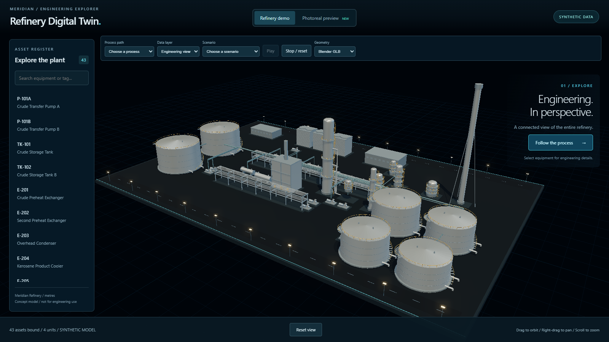

# Stage A — Task 01: Silhouette catalog

Status: submitted for Claude software review and Mostafa visual review. Task 02 has not started.

## 1. Summary

Added a plain Python catalog for the ten existing equipment types, with descriptions and representative metre-scale dimensions. Two tests keep the catalog aligned with the asset schema and require complete, positive sample dimensions. This establishes the catalog that later Stage A tasks will connect to generators and proxies. No plant data, geometry, materials, or runtime code changed.

## 2. Files touched

- `pipeline/catalog.py` — new ten-type `SILHOUETTES` dictionary, with no Blender imports.
- `tests/test_catalog.py` — schema parity and sample completeness tests.
- `docs/handbacks/stageA-task-01.md` — this required review hand-back.
- `docs/handbacks/evidence/stageA-task-01/default-view.png` — local build, default view, 1600 × 900.
- `docs/handbacks/evidence/stageA-task-01/browser-check.json` — browser version, capture dimensions, loading errors and selection smoke-check result.

The three documentation/evidence files are outside the original task's two-file implementation scope and are required by Mostafa's Stage A evidence ruling. Build output and temporary browser capture tooling are not committed.

## 3. New dependencies

None. The capture used the already available Playwright runtime and cached Chrome; no project dependency was added. The agent-browser CLI was unavailable, so the one-off capture used Playwright directly.

## 4. New assets

No third-party or runtime assets added. The screenshot is evidence generated from the existing application. No asset downloads or license changes.

## 5. Tests and build

Commands ran from `refinery-digital-twin-starter/` in PowerShell. Baseline `npm.cmd test` passed 11 Vitest tests and 16 pytest tests before implementation.

### Red: expected failure before creating the catalog

Command: `node scripts/python.mjs -m pytest tests/test_catalog.py -v` — exit 1, expected.

```text
============================= test session starts =============================
platform win32 -- Python 3.11.9, pytest-8.4.2, pluggy-1.6.0 -- C:\Users\Mosta\OneDrive\Documents\ChatGPT\Oil and Gas\refinery-digital-twin-starter\.venv\Scripts\python.exe
cachedir: .pytest_cache
rootdir: C:\Users\Mosta\OneDrive\Documents\ChatGPT\Oil and Gas\refinery-digital-twin-starter
configfile: pyproject.toml
collecting ... collected 0 items / 1 error

=================================== ERRORS ====================================
___________________ ERROR collecting tests/test_catalog.py ____________________
ImportError while importing test module 'C:\Users\Mosta\OneDrive\Documents\ChatGPT\Oil and Gas\refinery-digital-twin-starter\tests\test_catalog.py'.
Hint: make sure your test modules/packages have valid Python names.
Traceback:
C:\Program Files\Python311\Lib\importlib\__init__.py:126: in import_module
    return _bootstrap._gcd_import(name[level:], package, level)
           ^^^^^^^^^^^^^^^^^^^^^^^^^^^^^^^^^^^^^^^^^^^^^^^^^^^^
tests\test_catalog.py:3: in <module>
    from pipeline.catalog import SILHOUETTES
E   ModuleNotFoundError: No module named 'pipeline.catalog'
=========================== short test summary info ===========================
ERROR tests/test_catalog.py
!!!!!!!!!!!!!!!!!!! Interrupted: 1 error during collection !!!!!!!!!!!!!!!!!!!!
============================== 1 error in 0.34s ===============================
```

### Green: catalog acceptance

Command: `node scripts/python.mjs -m pytest tests/test_catalog.py -v` — exit 0.

```text
============================= test session starts =============================
platform win32 -- Python 3.11.9, pytest-8.4.2, pluggy-1.6.0 -- C:\Users\Mosta\OneDrive\Documents\ChatGPT\Oil and Gas\refinery-digital-twin-starter\.venv\Scripts\python.exe
cachedir: .pytest_cache
rootdir: C:\Users\Mosta\OneDrive\Documents\ChatGPT\Oil and Gas\refinery-digital-twin-starter
configfile: pyproject.toml
collecting ... collected 2 items

tests/test_catalog.py::test_catalog_matches_asset_schema PASSED          [ 50%]
tests/test_catalog.py::test_catalog_samples_are_complete PASSED          [100%]

============================== 2 passed in 0.15s ==============================
```

Command: `node scripts/python.mjs -m ruff check pipeline tests` — exit 0.

```text
All checks passed!
```

### Full pytest and Vitest gate

Command: `npm.cmd test` — exit 0.

```text
> refinery-digital-twin@0.0.0 test
> npm run test -w app && node scripts/python.mjs -m pytest

> @refinery/app@0.0.0 test
> vitest run

 RUN  v4.1.11 C:/Users/Mosta/OneDrive/Documents/ChatGPT/Oil and Gas/refinery-digital-twin-starter/app

 Test Files  4 passed (4)
      Tests  11 passed (11)
   Start at  01:38:19
   Duration  1.69s (transform 785ms, setup 0ms, import 3.59s, tests 347ms, environment 1ms)

============================= test session starts =============================
platform win32 -- Python 3.11.9, pytest-8.4.2, pluggy-1.6.0
rootdir: C:\Users\Mosta\OneDrive\Documents\ChatGPT\Oil and Gas\refinery-digital-twin-starter
configfile: pyproject.toml
testpaths: tests
collected 18 items

tests\test_catalog.py ..                                                 [ 11%]
tests\test_glb.py ..                                                     [ 22%]
tests\test_normalization.py ........                                     [ 66%]
tests\test_validation.py ......                                          [100%]

============================= 18 passed in 3.19s ==============================
```

`check:generators` does not exist yet; Stage A Task 02 introduces it. It was not run and is not claimed as passing.

### Local production build

Command: `npm.cmd run build -w app` — exit 0. The app-only command builds from the existing normalized data without running root normalization.

```text
> @refinery/app@0.0.0 build
> tsc --noEmit && vite build

vite v6.4.3 building for production...
transforming...
✓ 254 modules transformed.
rendering chunks...
computing gzip size...
dist/index.html                               0.37 kB │ gzip:   0.27 kB
dist/assets/index-DupH9ZgS.css               10.54 kB │ gzip:   3.12 kB
dist/assets/PhotorealPreview-DelRIFX0.js      5.30 kB │ gzip:   2.37 kB
dist/assets/index-36ejCEUz.js             1,315.70 kB │ gzip: 369.48 kB

(!) Some chunks are larger than 500 kB after minification. Consider:
- Using dynamic import() to code-split the application
- Use build.rollupOptions.output.manualChunks to improve chunking: https://rollupjs.org/configuration-options/#output-manualchunks
- Adjust chunk size limit for this warning via build.chunkSizeWarningLimit.
✓ built in 6.76s
```

The browser loaded the GLB successfully, reported no page errors or failed requests, and selecting F-201 displayed the correct heater card and model binding. Evidence: `evidence/stageA-task-01/browser-check.json`.

## 6. Metrics

Not collected, per Mostafa's Stage A ruling. No FPS, draw-call or GPU claims. No obvious stall surfaced in the brief load/select/reset smoke check; sustained orbit performance was not assessed. This task adds no runtime work.

## 7. Screenshots

Local production build served with `node scripts/serve.mjs` at `http://127.0.0.1:3000/#demo`. Capture: Chrome 146.0.7680.153, viewport 1600 × 900, device pixel ratio 1. The one-off browser capture was manually inspected; no pixel comparison was performed.



No new or changed units in Task 01, so no additional unit framings are required. A full-plant photoreal look does not exist yet; this hand-back does not present the separate preview study as that look.

## 8. Visual regression result

Not applicable during Stage A. The captured default view shows the existing dark HUD, plant equipment, grid, lamp posts and asset register. No visual source or generated model changed.

## 8a. Canonical data check

Canonical files changed: **none**. `git diff --name-only -- refinery-digital-twin-starter/data` returned no paths from the Git root.

| Count | Before | After |
|---|---:|---:|
| Assets | 43 | 43 |
| Units | 4 | 4 |

Stage A permits canonical changes when required. The frozen content hash and `data:verify` are not created until Stage B Task 0, after Stage A Task 8 approval.

## 9. Known issues and review status

- Existing production bundle warning: main JavaScript chunk exceeds 500 kB. Rendering/download optimization is outside this task.
- The existing untracked sibling `real-estate-poc/` was left untouched and excluded from commits.
- Catalog integration with Blender builders and runtime proxy families belongs to subsequent tasks; this task establishes the dictionary and schema guard only.
- Internal specification review: PASS, no actionable discrepancies. Reviewer independently inspected the code, ran the two targeted tests and Ruff, and checked scope. Historical red-test execution was supplied by the implementer rather than independently replayed.
- Internal code-quality review: PASS, no actionable findings. Reviewer inspected code and evidence without rerunning tests. Neither internal review constitutes Claude's approval or Mostafa's visual approval.
- No merge or deployment performed. Task 02 remains behind the two-reviewer gate.

## 10. Commit

Base commit: `6b4ee831512b0356e6904244f0477b37551c5b7f`.

Branch: `codex/stage-a-task-01`.

Implementation commit: `dc7ad70a3edb3ab80b8a1373c63cef0bb97396ba`.

The hand-back and its evidence are committed separately after the implementation so this record can identify the exact reviewed code commit.
