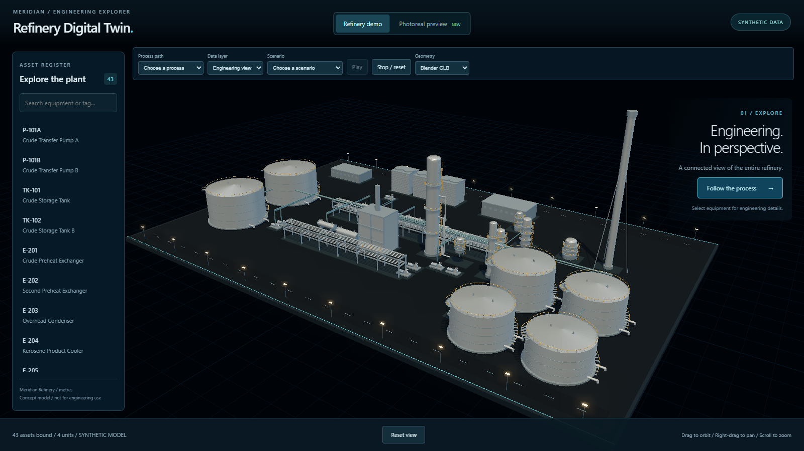

# Stage A — Task 02 gate: Kit, registry and generator checks

Status: ready for Claude software review and Mostafa visual review. Both external approvals are required at this gate. Stage A Task 03 has not started.

## 1. Summary

Refactored the ten existing equipment generators into a reusable `Kit` and an explicit `BUILDERS` registry. Added `npm run check:generators`, which runs inside Blender and validates all ten types at two detail levels, including naming, materials and geometry bounds. Regenerated the plant without changing its canonical data, and verified that all catalog samples and all 43 actual assets preserve their geometry and materials. The complete project check and production-serving test pass. Five local-build screenshots provide the default view and one framing for each existing unit.

Completed work included at this first gate:

- **Stage A Task 01 — ten-type silhouette catalog and schema/sample tests:** implementation `dc7ad70a3edb3ab80b8a1373c63cef0bb97396ba`; hand-back/evidence `48c2a5c2cba1fa74c2559e1f6aa6ba7ee081c638`. See [Task 01](stageA-task-01.md).

No other non-gate tasks have been completed. The latest working-mode ruling supersedes Task 01's historical statement that Task 02 was waiting at a per-task gate.

## 2. Files touched

Implementation:

- `blender/generators/equipment.py` — Kit primitives, reusable subassemblies, explicit builders and strict registry dispatch; existing geometry preserved.
- `blender/scripts/check_generators.py` — in-Blender catalog/registry, naming, material and bounds checks, with cleanup between cases.
- `scripts/check_generators.py` — Windows-compatible Blender discovery and nonzero error propagation.
- `package.json` — new `check:generators` script; no dependency changes.

Generated outputs required by Task 02 step 6/7:

- `blender/assets/refinery.blend` — regenerated authoring artifact.
- `data/normalized/models/refinery.glb` — regenerated runtime artifact.
- `data/normalized/models/build-report.json` — regenerated, content unchanged, so no Git diff.

Required hand-back and evidence:

- `docs/handbacks/stageA-task-02.md` — this gate report.
- `docs/handbacks/evidence/stageA-task-02/browser-check.json`
- `docs/handbacks/evidence/stageA-task-02/build-models.log`
- `docs/handbacks/evidence/stageA-task-02/default-view.png`
- `docs/handbacks/evidence/stageA-task-02/generators-green.log`
- `docs/handbacks/evidence/stageA-task-02/generators-lint.log`
- `docs/handbacks/evidence/stageA-task-02/generators-red.log`
- `docs/handbacks/evidence/stageA-task-02/geometry-parity-initial.json`
- `docs/handbacks/evidence/stageA-task-02/geometry-parity.json`
- `docs/handbacks/evidence/stageA-task-02/geometry-parity.log`
- `docs/handbacks/evidence/stageA-task-02/production-test.log`
- `docs/handbacks/evidence/stageA-task-02/project-check-sandbox-failure.log`
- `docs/handbacks/evidence/stageA-task-02/project-check.log`
- `docs/handbacks/evidence/stageA-task-02/sphere-face-order.log`
- `docs/handbacks/evidence/stageA-task-02/unit-cdu.png`
- `docs/handbacks/evidence/stageA-task-02/unit-crude.png`
- `docs/handbacks/evidence/stageA-task-02/unit-products.png`
- `docs/handbacks/evidence/stageA-task-02/unit-utilities.png`

The generated outputs are explicitly required by the Phase 1 task, despite not appearing in its opening four-file source list. Documentation and evidence are required by the Stage A rulings. No unrelated source files were changed. Build output and temporary one-off capture/audit scripts are not committed.

## 3. New dependencies

None. Existing Blender 5.2.1 LTS, Python environment, npm tooling, bundled Playwright and cached Chrome were used. No runtime or dev dependency was added.

## 4. New assets

No downloaded or third-party assets. Existing procedural plant outputs were regenerated; PNGs are application evidence. No licensing decisions were required.

## 5. Tests and validation

Commands ran in `refinery-digital-twin-starter/` on Windows/PowerShell. Raw logs are in `docs/handbacks/evidence/stageA-task-02/`; pasted output below has terminal colour escapes removed where present.

### Generator red test — expected exit 1

Command: `npm.cmd run check:generators`, after adding the checker but before the registry refactor. It failed on the intended missing `BUILDERS` import:

```text
> refinery-digital-twin@0.0.0 check:generators
> node scripts/python.mjs -m scripts.check_generators

00:00.187  reports          | WARNING Unable to open 'C:\Users\Mosta\AppData\Roaming\Blender Foundation\Blender\5.2\config\userpref.blend': Permission denied
Blender 5.2.1 LTS (hash 9e2066aef7ef built 2026-08-25 02:38:20)
Traceback (most recent call last):
  File "C:\Users\Mosta\OneDrive\Documents\ChatGPT\Oil and Gas\refinery-digital-twin-starter\blender\scripts\check_generators.py", line 12, in <module>
    from blender.generators.equipment import BUILDERS, build
ImportError: cannot import name 'BUILDERS' from 'blender.generators.equipment' (C:\Users\Mosta\OneDrive\Documents\ChatGPT\Oil and Gas\refinery-digital-twin-starter\blender\generators\equipment.py)

Error: script failed, file: 'C:\Users\Mosta\OneDrive\Documents\ChatGPT\Oil and Gas\refinery-digital-twin-starter\blender\scripts\check_generators.py', exiting.

Blender quit
Traceback (most recent call last):
  File "<frozen runpy>", line 198, in _run_module_as_main
  File "<frozen runpy>", line 88, in _run_code
  File "C:\Users\Mosta\OneDrive\Documents\ChatGPT\Oil and Gas\refinery-digital-twin-starter\scripts\check_generators.py", line 24, in <module>
    main()
  File "C:\Users\Mosta\OneDrive\Documents\ChatGPT\Oil and Gas\refinery-digital-twin-starter\scripts\check_generators.py", line 16, in main
    subprocess.run(
  File "C:\Program Files\Python311\Lib\subprocess.py", line 571, in run
    raise CalledProcessError(retcode, process.args,
subprocess.CalledProcessError: Command '['D:/blender/blender.exe', '--background', '--python-exit-code', '1', '--python', 'C:\\Users\\Mosta\\OneDrive\\Documents\\ChatGPT\\Oil and Gas\\refinery-digital-twin-starter\\blender\\scripts\\check_generators.py']' returned non-zero exit status 1.
```

### Final generator acceptance — exit 0

Command: `npm.cmd run check:generators` after the final ladder/API corrections. All ten catalog samples pass at detail 0 and detail 1. No geometry-bound tolerance was relaxed.

```text
> refinery-digital-twin@0.0.0 check:generators
> node scripts/python.mjs -m scripts.check_generators

00:00.078  reports          | WARNING Unable to open 'C:\Users\Mosta\AppData\Roaming\Blender Foundation\Blender\5.2\config\userpref.blend': Permission denied
Blender 5.2.1 LTS (hash 9e2066aef7ef built 2026-08-25 02:38:20)
Extensions: writing cache failed ([WinError 183] Cannot create a file when that file already exists: 'C:\\Users\\Mosta\\AppData\\Roaming\\Blender Foundation\\Blender\\5.2\\extensions\\.cache').
Checked 10 silhouettes at 2 detail levels

Blender quit
```

### Source lint — exit 0

Command: `node scripts/python.mjs -m ruff check blender/generators/equipment.py blender/scripts/check_generators.py scripts/check_generators.py`.

```text
All checks passed!
```

### Geometry/material preservation audit — exit 0

One-off command used: `D:/blender/blender.exe --background --python-exit-code 1 --python $env:TEMP/refinery-stageA-task02-parity.py`.

The audit loads the generator saved before this task and the current generator into Blender 5.2.1. It compares each of the ten catalog samples and all 43 canonical assets at both detail levels: 106 cases. It checks part count/order/names, vertex coordinates, object transforms, face topology/winding, smoothing, material assignment and shader values. The coordinate/transform tolerance was 0.00001; the observed maximum difference was exactly zero.

```text
Geometry parity: 106 cases, 0 failures
Maximum coordinate or transform difference: 0
```

Full per-case evidence: [geometry-parity.json](evidence/stageA-task-02/geometry-parity.json) and [geometry-parity.log](evidence/stageA-task-02/geometry-parity.log).

The first version of this one-off audit reported 21 mismatches because it compared the order of sphere polygon lists. A control experiment reproduced that difference using the original generator against itself. Sorting complete face records, while preserving each face's vertex winding, material index and smoothing flag, removes only the irrelevant list order; all records then match. The initial result is retained in `geometry-parity-initial.json`. The control experiment output is:

```text
00:00.078  reports          | WARNING Unable to open 'C:\Users\Mosta\AppData\Roaming\Blender Foundation\Blender\5.2\config\userpref.blend': Permission denied
Blender 5.2.1 LTS (hash 9e2066aef7ef built 2026-08-25 02:38:20)
Extensions: writing cache failed ([WinError 183] Cannot create a file when that file already exists: 'C:\\Users\\Mosta\\AppData\\Roaming\\Blender Foundation\\Blender\\5.2\\extensions\\.cache').
Extensions: writing cache failed ([WinError 183] Cannot create a file when that file already exists: 'C:\\Users\\Mosta\\AppData\\Roaming\\Blender Foundation\\Blender\\5.2\\extensions\\.cache').
Extensions: writing cache failed ([WinError 183] Cannot create a file when that file already exists: 'C:\\Users\\Mosta\\AppData\\Roaming\\Blender Foundation\\Blender\\5.2\\extensions\\.cache').
Original vs original polygon order equal: False
Original vs original sorted polygon records equal: True
Original vs refactored sorted polygon records equal: True
Original vs refactored vertex coordinates equal: True

Blender quit
```

### Plant regeneration — exit 0

Command: `npm.cmd run build:models`. Full output: [build-models.log](evidence/stageA-task-02/build-models.log). Final build-report output:

```json
{"assets": 43, "detail": 1, "mesh_objects": 153, "triangles": 168252}
```

This is identical to the previous build report: no change in triangle or mesh-object count. Regenerated binary files are not expected to be byte-identical; geometry equivalence was checked separately above.

### Complete project gate — exit 0

Command: `npm.cmd run check`. This runs normalization, ESLint, Ruff, Vitest, pytest, canonical validation, TypeScript and production build.

The first attempt failed at Vitest startup because the Windows sandbox denied esbuild access while resolving the existing Vite configuration. No source changes were made to work around it. The same command passed when rerun with approved filesystem access. The failed attempt is preserved in [project-check-sandbox-failure.log](evidence/stageA-task-02/project-check-sandbox-failure.log). Successful output:

```text
> refinery-digital-twin@0.0.0 check
> npm run normalize && npm run lint && npm test && npm run validate && npm run build


> refinery-digital-twin@0.0.0 normalize
> node scripts/python.mjs -m pipeline.normalize data/synthetic data/normalized

Validated normalized output written to data\normalized

> refinery-digital-twin@0.0.0 lint
> npm run lint -w app && node scripts/python.mjs -m ruff check pipeline tests


> @refinery/app@0.0.0 lint
> eslint src

All checks passed!

> refinery-digital-twin@0.0.0 test
> npm run test -w app && node scripts/python.mjs -m pytest


> @refinery/app@0.0.0 test
> vitest run


 RUN  v4.1.11 C:/Users/Mosta/OneDrive/Documents/ChatGPT/Oil and Gas/refinery-digital-twin-starter/app


 Test Files  4 passed (4)
      Tests  11 passed (11)
   Start at  06:18:52
   Duration  1.52s (transform 681ms, setup 0ms, import 3.05s, tests 424ms, environment 1ms)

============================= test session starts =============================
platform win32 -- Python 3.11.9, pytest-8.4.2, pluggy-1.6.0
rootdir: C:\Users\Mosta\OneDrive\Documents\ChatGPT\Oil and Gas\refinery-digital-twin-starter
configfile: pyproject.toml
testpaths: tests
collected 18 items

tests\test_catalog.py ..                                                 [ 11%]
tests\test_glb.py ..                                                     [ 22%]
tests\test_normalization.py ........                                     [ 66%]
tests\test_validation.py ......                                          [100%]

============================= 18 passed in 3.10s ==============================

> refinery-digital-twin@0.0.0 validate
> node scripts/python.mjs -m pipeline.validate data/synthetic && node scripts/python.mjs -m pipeline.validate data/normalized

Validated all collections in data\synthetic
Validated all collections in data\normalized

> refinery-digital-twin@0.0.0 prebuild
> npm run normalize


> refinery-digital-twin@0.0.0 normalize
> node scripts/python.mjs -m pipeline.normalize data/synthetic data/normalized

Validated normalized output written to data\normalized

> refinery-digital-twin@0.0.0 build
> npm run build -w app


> @refinery/app@0.0.0 build
> tsc --noEmit && vite build

vite v6.4.3 building for production...
transforming...
✓ 254 modules transformed.
rendering chunks...
computing gzip size...
dist/index.html                               0.37 kB │ gzip:   0.27 kB
dist/assets/index-DupH9ZgS.css               10.54 kB │ gzip:   3.12 kB
dist/assets/PhotorealPreview-DelRIFX0.js      5.30 kB │ gzip:   2.37 kB
dist/assets/index-36ejCEUz.js             1,315.70 kB │ gzip: 369.48 kB

(!) Some chunks are larger than 500 kB after minification. Consider:
- Using dynamic import() to code-split the application
- Use build.rollupOptions.output.manualChunks to improve chunking: https://rollupjs.org/configuration-options/#output-manualchunks
- Adjust chunk size limit for this warning via build.chunkSizeWarningLimit.
✓ built in 8.37s
```

### Production server test — exit 0

Command: `npm.cmd run test:production`.

```text
> refinery-digital-twin@0.0.0 test:production
> node --test tests/production.test.mjs

TAP version 13
# Subtest: production server serves the complete build with correct types and real missing-file errors
ok 1 - production server serves the complete build with correct types and real missing-file errors
  ---
  duration_ms: 594.5964
  type: 'test'
  ...
1..1
# tests 1
# suites 0
# pass 1
# fail 0
# cancelled 0
# skipped 0
# todo 0
# duration_ms 1029.9487
```

### Local browser check

The rebuilt GLB loads successfully. Selection/cards were checked for crude storage, crude distillation, utilities and product handling. The browser reported no page exceptions and no failed requests; the asset register shows 43 assets and four units. Details: [browser-check.json](evidence/stageA-task-02/browser-check.json).

## 6. Metrics

No performance metrics collected, per the Stage A ruling. The build-report counts above are the task's geometry-preservation acceptance check, not FPS or GPU measurements. No hangs occurred during the load/focus/reset smoke checks; frame-rate slowdown cannot be assessed from these still captures.

## 7. Screenshots

Local production build: `http://127.0.0.1:3000/#demo`. Chrome 146.0.7680.153, 1600 × 900 viewport, device pixel ratio 1. Captures were manually inspected; there is no pixel comparison or committed visual-baseline system. Unit frames use existing selection/focus controls; utilities and product handling were zoomed out for context. The current HUD and selection labels remain intact.

| Framing | Screenshot |
|---|---|
| Default overview | [default-view.png](evidence/stageA-task-02/default-view.png) |
| Crude storage — TK-101 | [unit-crude.png](evidence/stageA-task-02/unit-crude.png) |
| Crude distillation — T-201 | [unit-cdu.png](evidence/stageA-task-02/unit-cdu.png) |
| Utilities — CT-401 | [unit-utilities.png](evidence/stageA-task-02/unit-utilities.png) |
| Product handling — TK-301 | [unit-products.png](evidence/stageA-task-02/unit-products.png) |



No new unit was introduced. All existing units are shown because their equipment passes through the refactored generators. A unified photoreal look is not part of Stage A.

## 8. Visual regression result

No pixel comparison, per the Stage A ruling. The default scene and unit frames remain visually consistent with the existing HUD; geometry/material equivalence is supported by the independent audit. Close-up selection labels can obscure equipment; this existing runtime behaviour is outside Task 02 and was left unchanged.

## 8a. Canonical data check

Canonical files changed: **none**. Normalization ran as part of the required build/check commands, but `git diff --name-only -- data/synthetic 'data/normalized/*.json'` returned no paths from the project directory.

| Count | Before | After |
|---|---:|---:|
| Assets | 43 | 43 |
| Units | 4 | 4 |

Generated `.glb` and `.blend` changes are listed above separately. The canonical freeze/hash remains scheduled for Stage B Task 0 after Stage A Task 08 approval.

## 9. Known issues and review status

- Internal specification reviewer: **PASS**, including re-review of the corrected ladder convention and public helper signatures.
- Internal code-quality reviewer: **PASS**, no actionable defects. Both internal reviewers agree. Their findings do not replace Claude's software approval or Mostafa's visual approval.
- All final checks pass; expected red, corrected audit false positives, and the resolved sandbox failure are disclosed above.
- Blender emits preference-file/cache permission warnings in this sandbox. The model build also warns about relative paths for unused bundled brush materials. Generator checks and GLB export still pass; existing GLB tests validate embedded runtime content.
- Vite retains the existing warning about the main JavaScript chunk exceeding 500 kB. Performance/bundle optimization is outside this task.
- The requested `docs/plans/2026-09-24-dual-look-plan-v1.2.md` was not present at either repository path or in Downloads. This task follows the available `docs/superpowers/plans/2026-09-14-phase-1-silhouette-library.md` Task 02, with the user's latest evidence, review-cadence and branching rulings taking precedence. No replacement plan was invented.
- The unrelated untracked sibling `real-estate-poc/` was left untouched and excluded from commits.
- No merge, push or deployment. Main is unchanged. Stage A Task 03 is held at this external gate.

## 10. Commit and branch

Branch: `codex/stage-a`, created from completed Task 01.

Base: `48c2a5c2cba1fa74c2559e1f6aa6ba7ee081c638`.

Implementation and regenerated plant: `b7eba5f17c66586cbddc37c9f834a03e99370c87`.

This hand-back and its evidence are committed separately after implementation, so the exact reviewed code commit can be recorded here.
