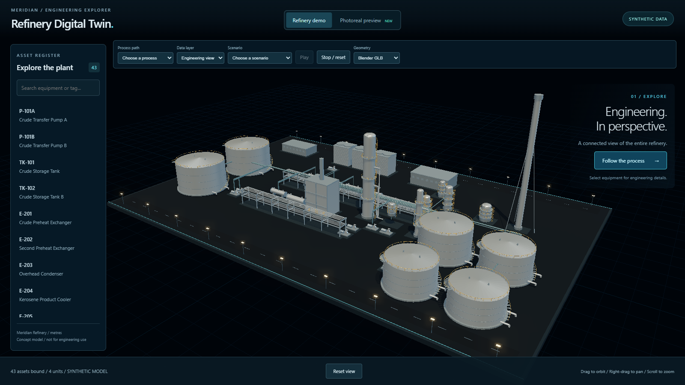
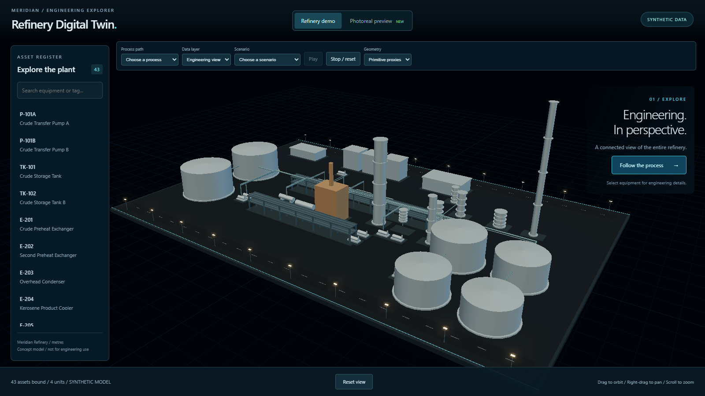
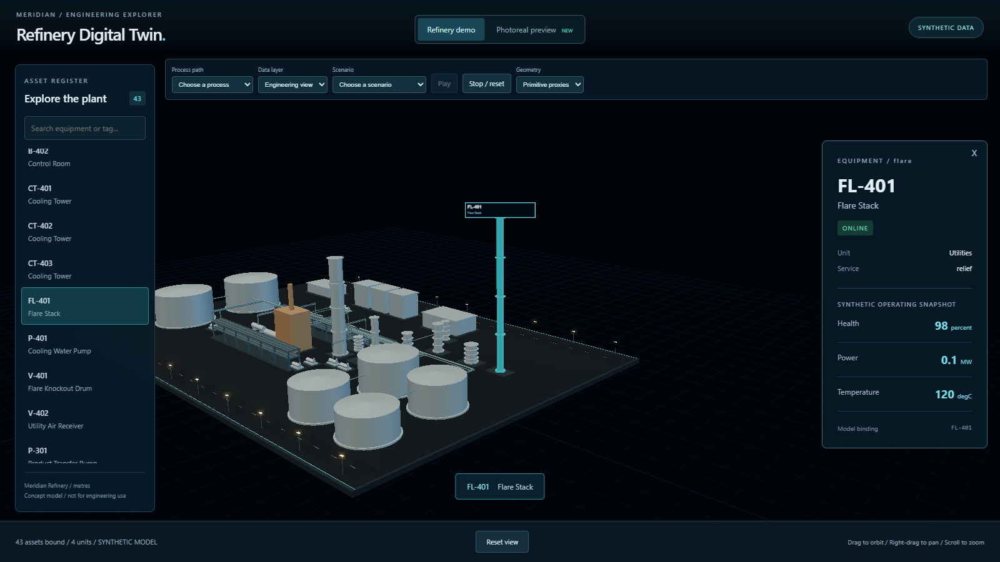

# Stage A Task 03: Runtime proxy families

Status: completed after internal spec and code-quality review; no external gate required.

## Summary

Added the schema-aligned proxy-family table and its parity test. Proxy rendering and site pad filtering use the tables. Existing equipment geometry is preserved; separate sphere and stack branches support the upcoming new types.

## Files touched

- `app/src/data/silhouettes.ts`: proxy-family and self-foundation tables.
- `app/src/data/silhouettes.test.ts`: schema parity and foundation membership test.
- `app/src/Scene.tsx`: family dispatch and future sphere/standalone-stack branches.
- `app/src/Atmosphere.tsx`: shared foundation filter.
- `docs/handbacks/stageA-task-03.md` and `docs/handbacks/evidence/stageA-task-03/`: hand-back, test logs, screenshots and browser evidence.

No dependencies or third-party assets added. No canonical files changed. Assets: 43 before / 43 after. Units: 4 before / 4 after.

## Known issues

Mostafa explicitly approved preserving the current flare appearance exactly: four platforms and foundation radius `d / 2 + 0.7`. Flare remains in the vertical family; the new stack geometry applies only to standalone stack types added later. This ruling supersedes the Phase 1 Task 03 sample mapping `flare: 'stack'` and resolves the blocker recorded in commit `b317257`.

## Reviews

Internal spec review: PASS; independent comparison against b317257 confirmed all scoped requirements and the flare ruling.
Internal code-quality review: PASS; no actionable findings. Both reviewers agree.

## Manual visual evidence

Screenshots captured from the local production build at 1600 x 900, device pixel ratio 1. Manual review only; no pixel comparison or metrics. No new or changed unit geometry in this refactor. Default GLB, default proxy, and selected flare proxy frames are supplied. Visual inspection: the GLB overview loads, proxy geometry is coherent, and the flare retains its four platforms and existing foundation. No visible hangs or new sluggishness during the smoke check; no performance measurements claimed. Browser check recorded zero page errors.







## Test output

### silhouettes-red.log

```text

> @refinery/app@0.0.0 test
> vitest run silhouettes


 RUN  v4.1.11 C:/Users/Mosta/OneDrive/Documents/ChatGPT/Oil and Gas/refinery-digital-twin-starter/app

 ❯ src/data/silhouettes.test.ts (0 test)

⎯⎯⎯⎯⎯⎯ Failed Suites 1 ⎯⎯⎯⎯⎯⎯⎯

 FAIL  src/data/silhouettes.test.ts [ src/data/silhouettes.test.ts ]
Error: Cannot find module './silhouettes' imported from C:/Users/Mosta/OneDrive/Documents/ChatGPT/Oil and Gas/refinery-digital-twin-starter/app/src/data/silhouettes.test.ts

 ❯ src/data/silhouettes.test.ts:3:1
      1| import { expect, it } from 'vitest';
      2| import schema from '../../../schemas/asset.schema.json';
      3| import { proxyFamily, selfFoundation } from './silhouettes';
       | ^
      4|
      5| it('every canonical asset type has a proxy family and nothing else doe…

⎯⎯⎯⎯⎯⎯⎯⎯⎯⎯⎯⎯⎯⎯⎯⎯⎯⎯⎯⎯⎯⎯⎯⎯[1/1]⎯

 Test Files  1 failed (1)
      Tests  no tests
   Start at  06:51:38
   Duration  684ms (transform 88ms, setup 0ms, import 0ms, tests 0ms, environment 0ms)

npm error Lifecycle script `test` failed with error:
npm error code 1
npm error path C:\Users\Mosta\OneDrive\Documents\ChatGPT\Oil and Gas\refinery-digital-twin-starter\app
npm error workspace @refinery/app@0.0.0
npm error location C:\Users\Mosta\OneDrive\Documents\ChatGPT\Oil and Gas\refinery-digital-twin-starter\app
npm error command failed
npm error command C:\WINDOWS\system32\cmd.exe /d /s /c vitest run silhouettes
```

### silhouettes-green.log

```text

> @refinery/app@0.0.0 test
> vitest run silhouettes


 RUN  v4.1.11 C:/Users/Mosta/OneDrive/Documents/ChatGPT/Oil and Gas/refinery-digital-twin-starter/app


 Test Files  1 passed (1)
      Tests  1 passed (1)
   Start at  06:53:08
   Duration  465ms (transform 77ms, setup 0ms, import 112ms, tests 6ms, environment 0ms)
```

### generators.log

```text

> refinery-digital-twin@0.0.0 check:generators
> node scripts/python.mjs -m scripts.check_generators

00:00.109  reports          | WARNING Unable to open 'C:\Users\Mosta\AppData\Roaming\Blender Foundation\Blender\5.2\config\userpref.blend': Permission denied
Blender 5.2.1 LTS (hash 9e2066aef7ef built 2026-08-25 02:38:20)
Extensions: writing cache failed ([WinError 183] Cannot create a file when that file already exists: 'C:\\Users\\Mosta\\AppData\\Roaming\\Blender Foundation\\Blender\\5.2\\extensions\\.cache').
Checked 10 silhouettes at 2 detail levels

Blender quit
```

### project-check.log

```text

> refinery-digital-twin@0.0.0 check
> npm run normalize && npm run lint && npm test && npm run validate && npm run build


> refinery-digital-twin@0.0.0 normalize
> node scripts/python.mjs -m pipeline.normalize data/synthetic data/normalized

Validated normalized output written to data\normalized

> refinery-digital-twin@0.0.0 lint
> npm run lint -w app && node scripts/python.mjs -m ruff check pipeline tests


> @refinery/app@0.0.0 lint
> eslint src

All checks passed!

> refinery-digital-twin@0.0.0 test
> npm run test -w app && node scripts/python.mjs -m pytest


> @refinery/app@0.0.0 test
> vitest run


 RUN  v4.1.11 C:/Users/Mosta/OneDrive/Documents/ChatGPT/Oil and Gas/refinery-digital-twin-starter/app


 Test Files  5 passed (5)
      Tests  12 passed (12)
   Start at  06:53:33
   Duration  1.65s (transform 723ms, setup 0ms, import 3.55s, tests 341ms, environment 1ms)

============================= test session starts =============================
platform win32 -- Python 3.11.9, pytest-8.4.2, pluggy-1.6.0
rootdir: C:\Users\Mosta\OneDrive\Documents\ChatGPT\Oil and Gas\refinery-digital-twin-starter
configfile: pyproject.toml
testpaths: tests
collected 18 items

tests\test_catalog.py ..                                                 [ 11%]
tests\test_glb.py ..                                                     [ 22%]
tests\test_normalization.py ........                                     [ 66%]
tests\test_validation.py ......                                          [100%]

============================= 18 passed in 3.16s ==============================

> refinery-digital-twin@0.0.0 validate
> node scripts/python.mjs -m pipeline.validate data/synthetic && node scripts/python.mjs -m pipeline.validate data/normalized

Validated all collections in data\synthetic
Validated all collections in data\normalized

> refinery-digital-twin@0.0.0 prebuild
> npm run normalize


> refinery-digital-twin@0.0.0 normalize
> node scripts/python.mjs -m pipeline.normalize data/synthetic data/normalized

Validated normalized output written to data\normalized

> refinery-digital-twin@0.0.0 build
> npm run build -w app


> @refinery/app@0.0.0 build
> tsc --noEmit && vite build

vite v6.4.3 building for production...
transforming...
✓ 255 modules transformed.
rendering chunks...
computing gzip size...
dist/index.html                               0.37 kB │ gzip:   0.27 kB
dist/assets/index-DupH9ZgS.css               10.54 kB │ gzip:   3.12 kB
dist/assets/PhotorealPreview-J1pK14k6.js      5.30 kB │ gzip:   2.37 kB
dist/assets/index-DsBuxWNe.js             1,316.37 kB │ gzip: 369.69 kB

(!) Some chunks are larger than 500 kB after minification. Consider:
- Using dynamic import() to code-split the application
- Use build.rollupOptions.output.manualChunks to improve chunking: https://rollupjs.org/configuration-options/#output-manualchunks
- Adjust chunk size limit for this warning via build.chunkSizeWarningLimit.
✓ built in 7.00s
```


