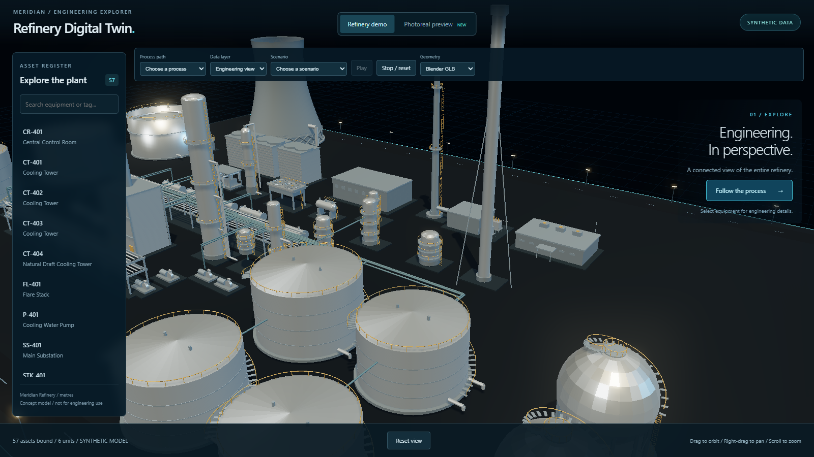
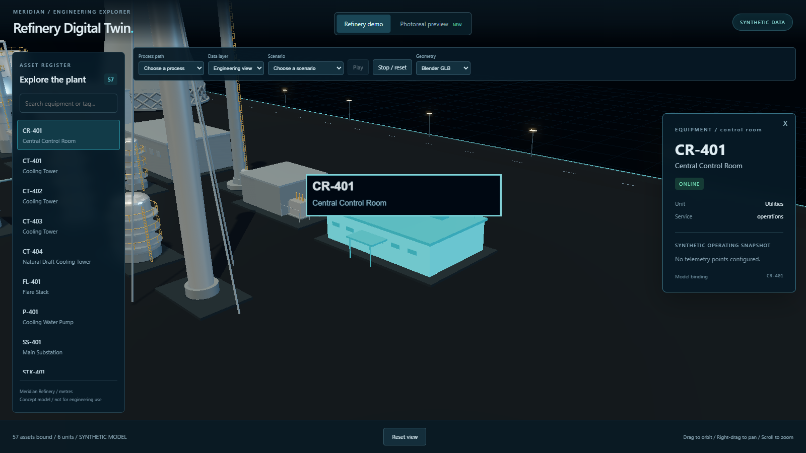
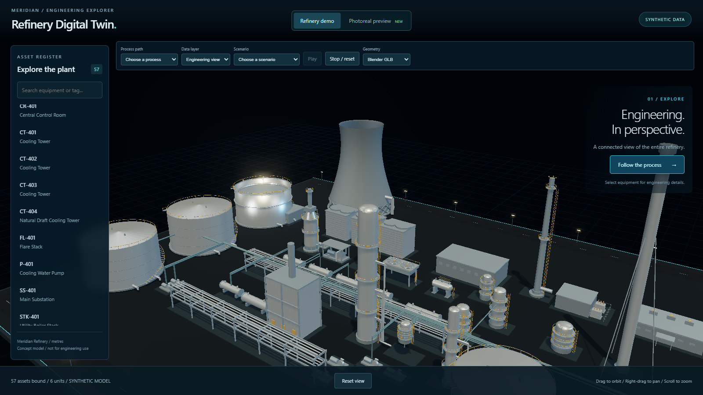
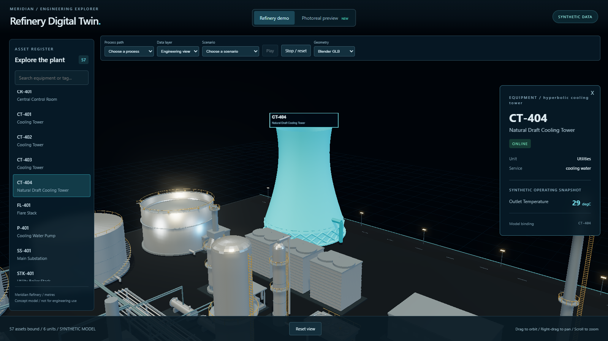
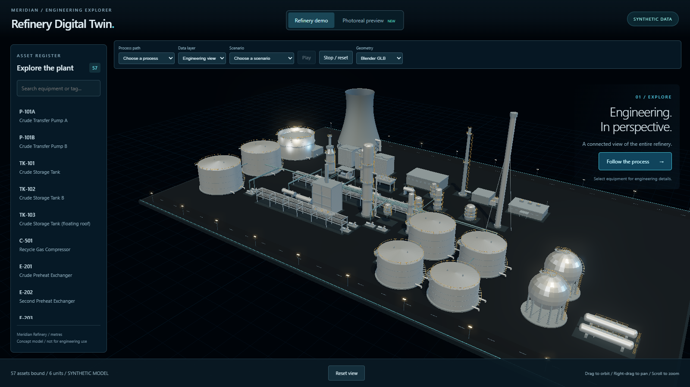
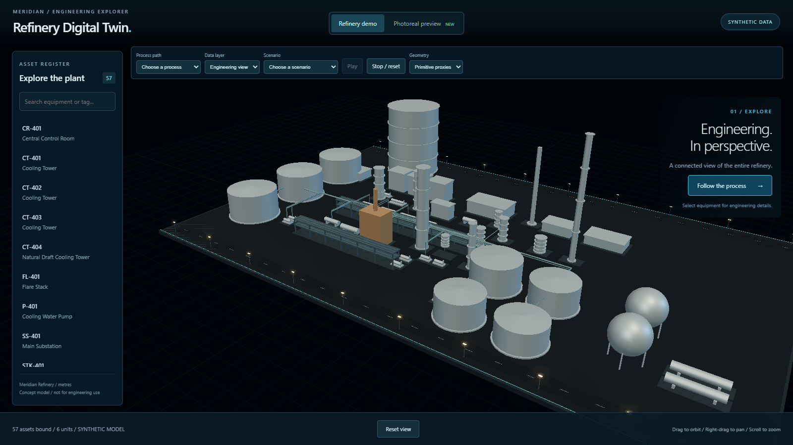
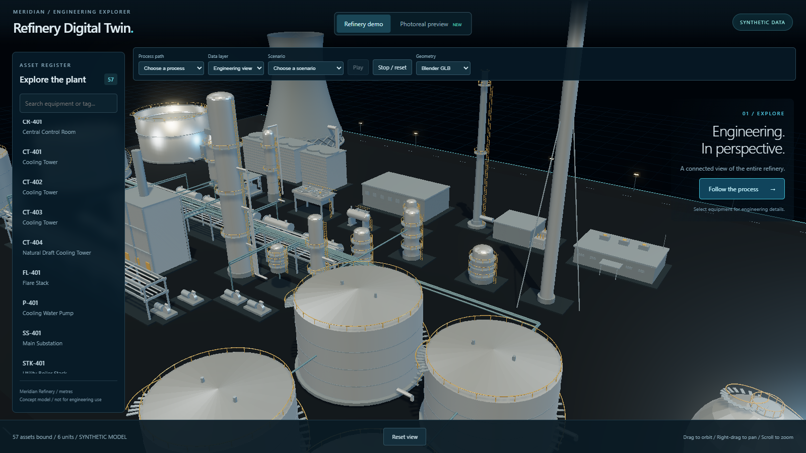
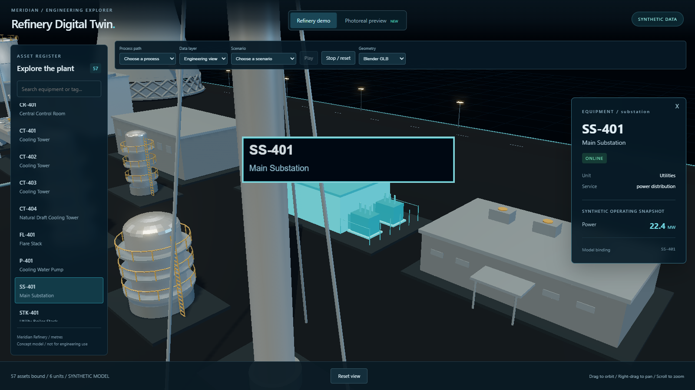

# Stage A Task 07

Status: complete; both internal reviews pass.

## Summary

Completed the silhouette library with the hyperbolic cooling tower, substation and control room. Widened the default reset camera to the prescribed (250, 140, 200), bringing the expanded plant equipment into view.

Assets / units: 54 assets / 6 units before; 57 assets / 6 units after.

## Files touched

- `refinery-digital-twin-starter/app/src/Scene.tsx`
- `refinery-digital-twin-starter/app/src/data/silhouettes.ts`
- `refinery-digital-twin-starter/blender/assets/refinery.blend`
- `refinery-digital-twin-starter/blender/generators/equipment.py`
- `refinery-digital-twin-starter/data/normalized/assets.json`
- `refinery-digital-twin-starter/data/normalized/model_bindings.json`
- `refinery-digital-twin-starter/data/normalized/models/build-report.json`
- `refinery-digital-twin-starter/data/normalized/models/refinery.glb`
- `refinery-digital-twin-starter/data/normalized/telemetry.json`
- `refinery-digital-twin-starter/data/synthetic/assets.json`
- `refinery-digital-twin-starter/data/synthetic/model_bindings.json`
- `refinery-digital-twin-starter/data/synthetic/telemetry.json`
- `refinery-digital-twin-starter/pipeline/catalog.py`
- `refinery-digital-twin-starter/schemas/asset.schema.json`
- `docs/handbacks/stageA-task-07.md` and `docs/handbacks/evidence/stageA-task-07/`: required hand-back and evidence.

## Canonical changes

- `refinery-digital-twin-starter/data/normalized/assets.json` — Added the task equipment records.
- `refinery-digital-twin-starter/data/normalized/model_bindings.json` — Added model bindings for the task equipment.
- `refinery-digital-twin-starter/data/normalized/telemetry.json` — Added specified synthetic operating points.
- `refinery-digital-twin-starter/data/synthetic/assets.json` — Added the task equipment records.
- `refinery-digital-twin-starter/data/synthetic/model_bindings.json` — Added model bindings for the task equipment.
- `refinery-digital-twin-starter/data/synthetic/telemetry.json` — Added specified synthetic operating points.
- `refinery-digital-twin-starter/pipeline/catalog.py` — Added the new type descriptions and dimension samples.
- `refinery-digital-twin-starter/schemas/asset.schema.json` — Extended the equipment type enum.

## Dependencies and assets

No new dependencies or downloaded assets. Geometry is generated locally by Blender.

## Internal reviews

Spec: PASS (utilities_spec_review). Quality: PASS (utilities_quality_review). No open findings or reviewer disagreement.

## Visual evidence

Local production build, 1600 x 900, device pixel ratio 1. Manual inspection only; no pixel comparisons or performance metrics. Manually inspected default view and selected CT-404, SS-401 and CR-401 frames: tower profile and diagonal supports, transformer yard and control-room canopy/HVAC are visible. The prescribed widened camera now contains the tower and both LPG bullets; the outer site slab reaches the screen edge, but equipment is framed. Card assertions passed. Browser recorded no page errors or failed requests. No visible hangs or new sluggishness during interaction; no performance metrics claimed.

















## Tests and task acceptance

### 01-catalog-red.log

```text
F.                                                                       [100%]
================================== FAILURES ===================================
______________________ test_catalog_matches_asset_schema ______________________

    def test_catalog_matches_asset_schema():
        schema = json.loads((ROOT / "schemas" / "asset.schema.json").read_text(encoding="utf-8"))
>       assert set(SILHOUETTES) == set(schema["properties"]["type"]["enum"])
E       AssertionError: assert {'air_cooler'...ol_room', ...} == {'air_cooler'...g_tower', ...}
E         
E         Extra items in the left set:
E         'control_room'
E         'hyperbolic_cooling_tower'
E         'substation'
E         Use -v to get more diff

tests\test_catalog.py:9: AssertionError
=========================== short test summary info ===========================
FAILED tests/test_catalog.py::test_catalog_matches_asset_schema - AssertionEr...
1 failed, 1 passed in 0.26s
```

### 02-catalog-green.log

```text
..                                                                       [100%]
2 passed in 0.15s
```

### 03-proxy-red.log

```text

> @refinery/app@0.0.0 test
> vitest run src/data/silhouettes.test.ts


 RUN  v4.1.11 C:/Users/Mosta/OneDrive/Documents/ChatGPT/Oil and Gas/refinery-digital-twin-starter/app

 ❯ src/data/silhouettes.test.ts (1 test | 1 failed) 14ms
   × every canonical asset type has a proxy family and nothing else does 12ms

⎯⎯⎯⎯⎯⎯⎯ Failed Tests 1 ⎯⎯⎯⎯⎯⎯⎯

 FAIL  src/data/silhouettes.test.ts > every canonical asset type has a proxy family and nothing else does
AssertionError: expected [ 'air_cooler', 'building', …(17) ] to deeply equal [ 'air_cooler', 'building', …(20) ]

- Expected
+ Received

@@ -2,23 +2,20 @@
    "air_cooler",
    "building",
    "bullet_tank",
    "column",
    "compressor",
-   "control_room",
    "cooling_tower",
    "cylindrical_heater",
    "fired_heater",
    "flare",
    "floating_roof_tank",
    "heat_exchanger",
    "horizontal_drum",
-   "hyperbolic_cooling_tower",
    "pipe_rack",
    "pump",
    "reactor",
    "sphere_tank",
    "stack",
    "storage_tank",
-   "substation",
    "vessel",
  ]

 ❯ src/data/silhouettes.test.ts:7:43
      5| it('every canonical asset type has a proxy family and nothing else doe…
      6|   const types = schema.properties.type.enum as string[];
      7|   expect(Object.keys(proxyFamily).sort()).toEqual([...types].sort());
       |                                           ^
      8|   for (const type of selfFoundation) expect(types).toContain(type);
      9| });

⎯⎯⎯⎯⎯⎯⎯⎯⎯⎯⎯⎯⎯⎯⎯⎯⎯⎯⎯⎯⎯⎯⎯⎯[1/1]⎯


 Test Files  1 failed (1)
      Tests  1 failed (1)
   Start at  07:22:42
   Duration  556ms (transform 63ms, setup 0ms, import 101ms, tests 14ms, environment 0ms)

npm error Lifecycle script `test` failed with error:
npm error code 1
npm error path C:\Users\Mosta\OneDrive\Documents\ChatGPT\Oil and Gas\refinery-digital-twin-starter\app
npm error workspace @refinery/app@0.0.0
npm error location C:\Users\Mosta\OneDrive\Documents\ChatGPT\Oil and Gas\refinery-digital-twin-starter\app
npm error command failed
npm error command C:\WINDOWS\system32\cmd.exe /d /s /c vitest run src/data/silhouettes.test.ts
```

### 04-proxy-green.log

```text

> @refinery/app@0.0.0 test
> vitest run src/data/silhouettes.test.ts


 RUN  v4.1.11 C:/Users/Mosta/OneDrive/Documents/ChatGPT/Oil and Gas/refinery-digital-twin-starter/app


 Test Files  1 passed (1)
      Tests  1 passed (1)
   Start at  07:23:36
   Duration  473ms (transform 63ms, setup 0ms, import 103ms, tests 6ms, environment 0ms)
```

### 05-registry-red.log

```text

> refinery-digital-twin@0.0.0 check:generators
> node scripts/python.mjs -m scripts.check_generators

00:00.125  reports          | WARNING Unable to open 'C:\Users\Mosta\AppData\Roaming\Blender Foundation\Blender\5.2\config\userpref.blend': Permission denied
Blender 5.2.1 LTS (hash 9e2066aef7ef built 2026-08-25 02:38:20)
Traceback (most recent call last):
  File "C:\Users\Mosta\OneDrive\Documents\ChatGPT\Oil and Gas\refinery-digital-twin-starter\blender\scripts\check_generators.py", line 71, in <module>
    main()
    ~~~~^^
  File "C:\Users\Mosta\OneDrive\Documents\ChatGPT\Oil and Gas\refinery-digital-twin-starter\blender\scripts\check_generators.py", line 23, in main
    require(
    ~~~~~~~^
        set(BUILDERS) == set(SILHOUETTES),
        ^^^^^^^^^^^^^^^^^^^^^^^^^^^^^^^^^^
        f"Registry/catalog mismatch: missing={set(SILHOUETTES) - set(BUILDERS)}, "
        ^^^^^^^^^^^^^^^^^^^^^^^^^^^^^^^^^^^^^^^^^^^^^^^^^^^^^^^^^^^^^^^^^^^^^^^^^^
        f"extra={set(BUILDERS) - set(SILHOUETTES)}",
        ^^^^^^^^^^^^^^^^^^^^^^^^^^^^^^^^^^^^^^^^^^^^
    )
    ^
  File "C:\Users\Mosta\OneDrive\Documents\ChatGPT\Oil and Gas\refinery-digital-twin-starter\blender\scripts\check_generators.py", line 18, in require
    raise AssertionError(message)
AssertionError: Registry/catalog mismatch: missing={'control_room', 'hyperbolic_cooling_tower', 'substation'}, extra=set()
Extensions: writing cache failed ([WinError 183] Cannot create a file when that file already exists: 'C:\\Users\\Mosta\\AppData\\Roaming\\Blender Foundation\\Blender\\5.2\\extensions\\.cache').

Error: script failed, file: 'C:\Users\Mosta\OneDrive\Documents\ChatGPT\Oil and Gas\refinery-digital-twin-starter\blender\scripts\check_generators.py', exiting.

Blender quit
Traceback (most recent call last):
  File "<frozen runpy>", line 198, in _run_module_as_main
  File "<frozen runpy>", line 88, in _run_code
  File "C:\Users\Mosta\OneDrive\Documents\ChatGPT\Oil and Gas\refinery-digital-twin-starter\scripts\check_generators.py", line 32, in <module>
    main()
  File "C:\Users\Mosta\OneDrive\Documents\ChatGPT\Oil and Gas\refinery-digital-twin-starter\scripts\check_generators.py", line 17, in main
    subprocess.run(
  File "C:\Program Files\Python311\Lib\subprocess.py", line 571, in run
    raise CalledProcessError(retcode, process.args,
subprocess.CalledProcessError: Command '['D:/blender/blender.exe', '--background', '--python-exit-code', '1', '--python', 'C:\\Users\\Mosta\\OneDrive\\Documents\\ChatGPT\\Oil and Gas\\refinery-digital-twin-starter\\blender\\scripts\\check_generators.py']' returned non-zero exit status 1.
```

### 06-registry-green.log

```text

> refinery-digital-twin@0.0.0 check:generators
> node scripts/python.mjs -m scripts.check_generators

00:00.109  reports          | WARNING Unable to open 'C:\Users\Mosta\AppData\Roaming\Blender Foundation\Blender\5.2\config\userpref.blend': Permission denied
Blender 5.2.1 LTS (hash 9e2066aef7ef built 2026-08-25 02:38:20)
Extensions: writing cache failed ([WinError 183] Cannot create a file when that file already exists: 'C:\\Users\\Mosta\\AppData\\Roaming\\Blender Foundation\\Blender\\5.2\\extensions\\.cache').
Checked 22 silhouettes at 2 detail levels

Blender quit
```

### 07-ruff.log

```text
All checks passed!
```

### build-models.log

```text

> refinery-digital-twin@0.0.0 build:models
> node scripts/python.mjs -m scripts.build_models

01:09.187  reports          | WARNING Path 'D:\blender\5.2\datafiles\assets\brushes\essentials_brushes-gp_draw.blend' cannot be made relative for Material 'Dots Stroke'
Blender 5.2.1 LTS (hash 9e2066aef7ef built 2026-08-25 02:38:20)
01:09.187  reports          | WARNING Path 'D:\blender\5.2\datafiles\assets\brushes\essentials_brushes-gp_draw.blend' cannot be made relative for Material 'Material'
Info: Saved as "refinery.blend"
INFO Draco is available, use library at D:\blender\5.2\scripts\addons_core\io_scene_gltf2\bf_intern_draco_bridge.dll
INFO MeshOptimizer is available, use library at D:\blender\5.2\scripts\addons_core\io_scene_gltf2\bf_intern_meshopt_bridge.dll
07:26:00 | INFO: Starting glTF 2.0 export
07:26:00 | INFO: Extracting primitive: P-101A_mesh
07:26:00 | INFO: Primitives created: 3
07:26:00 | INFO: Extracting primitive: P-101B_mesh
07:26:00 | INFO: Primitives created: 3
07:26:00 | INFO: Extracting primitive: TK-101_mesh
07:26:00 | INFO: Primitives created: 4
07:26:00 | INFO: Extracting primitive: TK-102_mesh
07:26:00 | INFO: Primitives created: 4
07:26:00 | INFO: Extracting primitive: TK-103_mesh
07:26:00 | INFO: Primitives created: 4
07:26:00 | INFO: Extracting primitive: E-201_mesh
07:26:00 | INFO: Primitives created: 3
07:26:00 | INFO: Extracting primitive: E-202_mesh
07:26:00 | INFO: Primitives created: 3
07:26:00 | INFO: Extracting primitive: E-203_mesh
07:26:00 | INFO: Primitives created: 3
07:26:00 | INFO: Extracting primitive: E-204_mesh
07:26:00 | INFO: Primitives created: 3
07:26:00 | INFO: Extracting primitive: E-205_mesh
07:26:00 | INFO: Primitives created: 3
07:26:00 | INFO: Extracting primitive: E-206_mesh
07:26:00 | INFO: Primitives created: 3
07:26:00 | INFO: Extracting primitive: E-207_mesh
07:26:00 | INFO: Primitives created: 3
07:26:00 | INFO: Extracting primitive: F-201_mesh
07:26:00 | INFO: Primitives created: 3
07:26:00 | INFO: Extracting primitive: P-201_mesh
07:26:00 | INFO: Primitives created: 3
07:26:00 | INFO: Extracting primitive: P-202_mesh
07:26:00 | INFO: Primitives created: 3
07:26:00 | INFO: Extracting primitive: P-203_mesh
07:26:00 | INFO: Primitives created: 3
07:26:00 | INFO: Extracting primitive: P-204_mesh
07:26:00 | INFO: Primitives created: 3
07:26:00 | INFO: Extracting primitive: PR-001_mesh
07:26:00 | INFO: Primitives created: 2
07:26:00 | INFO: Extracting primitive: PR-002_mesh
07:26:00 | INFO: Primitives created: 2
07:26:00 | INFO: Extracting primitive: PR-003_mesh
07:26:00 | INFO: Primitives created: 2
07:26:00 | INFO: Extracting primitive: PR-004_mesh
07:26:00 | INFO: Primitives created: 2
07:26:00 | INFO: Extracting primitive: PR-005_mesh
07:26:00 | INFO: Primitives created: 2
07:26:00 | INFO: Extracting primitive: PR-006_mesh
07:26:00 | INFO: Primitives created: 2
07:26:00 | INFO: Extracting primitive: PR-007_mesh
07:26:00 | INFO: Primitives created: 2
07:26:00 | INFO: Extracting primitive: T-201_mesh
07:26:00 | INFO: Primitives created: 4
07:26:00 | INFO: Extracting primitive: V-202_mesh
07:26:00 | INFO: Primitives created: 4
07:26:00 | INFO: Extracting primitive: V-203_mesh
07:26:00 | INFO: Primitives created: 4
07:26:00 | INFO: Extracting primitive: C-501_mesh
07:26:00 | INFO: Primitives created: 4
07:26:00 | INFO: Extracting primitive: EA-501_mesh
07:26:00 | INFO: Primitives created: 3
07:26:00 | INFO: Extracting primitive: F-501_mesh
07:26:00 | INFO: Primitives created: 4
07:26:00 | INFO: Extracting primitive: R-501_mesh
07:26:00 | INFO: Primitives created: 4
07:26:00 | INFO: Extracting primitive: V-501_mesh
07:26:00 | INFO: Primitives created: 4
07:26:00 | INFO: Extracting primitive: B-401_mesh
07:26:00 | INFO: Primitives created: 2
07:26:00 | INFO: Extracting primitive: B-402_mesh
07:26:00 | INFO: Primitives created: 2
07:26:00 | INFO: Extracting primitive: CR-401_mesh
07:26:00 | INFO: Primitives created: 3
07:26:00 | INFO: Extracting primitive: CT-401_mesh
07:26:00 | INFO: Primitives created: 2
07:26:00 | INFO: Extracting primitive: CT-402_mesh
07:26:00 | INFO: Primitives created: 2
07:26:00 | INFO: Extracting primitive: CT-403_mesh
07:26:00 | INFO: Primitives created: 2
07:26:00 | INFO: Extracting primitive: CT-404_mesh
07:26:00 | INFO: Primitives created: 3
07:26:00 | INFO: Extracting primitive: FL-401_mesh
07:26:00 | INFO: Primitives created: 3
07:26:00 | INFO: Extracting primitive: P-401_mesh
07:26:00 | INFO: Primitives created: 3
07:26:00 | INFO: Extracting primitive: SS-401_mesh
07:26:00 | INFO: Primitives created: 4
07:26:00 | INFO: Extracting primitive: STK-401_mesh
07:26:00 | INFO: Primitives created: 3
07:26:00 | INFO: Extracting primitive: V-401_mesh
07:26:00 | INFO: Primitives created: 4
07:26:00 | INFO: Extracting primitive: V-402_mesh
07:26:00 | INFO: Primitives created: 4
07:26:00 | INFO: Extracting primitive: BT-501_mesh
07:26:00 | INFO: Primitives created: 4
07:26:00 | INFO: Extracting primitive: BT-502_mesh
07:26:00 | INFO: Primitives created: 4
07:26:00 | INFO: Extracting primitive: SP-501_mesh
07:26:00 | INFO: Primitives created: 4
07:26:00 | INFO: Extracting primitive: SP-502_mesh
07:26:00 | INFO: Primitives created: 4
07:26:00 | INFO: Extracting primitive: P-301_mesh
07:26:00 | INFO: Primitives created: 3
07:26:00 | INFO: Extracting primitive: P-302_mesh
07:26:00 | INFO: Primitives created: 3
07:26:00 | INFO: Extracting primitive: T-302_mesh
07:26:00 | INFO: Primitives created: 4
07:26:00 | INFO: Extracting primitive: TK-301_mesh
07:26:00 | INFO: Primitives created: 4
07:26:00 | INFO: Extracting primitive: TK-302_mesh
07:26:00 | INFO: Primitives created: 4
07:26:00 | INFO: Extracting primitive: TK-303_mesh
07:26:00 | INFO: Primitives created: 4
07:26:00 | INFO: Extracting primitive: TK-304_mesh
07:26:00 | INFO: Primitives created: 4
07:26:00 | INFO: Extracting primitive: V-301_mesh
07:26:00 | INFO: Primitives created: 4
07:26:00 | INFO: Extracting primitive: conn_001_0_mesh
07:26:00 | INFO: Primitives created: 1
07:26:00 | INFO: Extracting primitive: conn_001_1_mesh
07:26:00 | INFO: Primitives created: 1
07:26:00 | INFO: Extracting primitive: conn_001_2_mesh
07:26:00 | INFO: Primitives created: 1
07:26:00 | INFO: Extracting primitive: conn_001_3_mesh
07:26:00 | INFO: Primitives created: 1
07:26:00 | INFO: Extracting primitive: conn_001_4_mesh
07:26:00 | INFO: Primitives created: 1
07:26:00 | INFO: Extracting primitive: conn_002_0_mesh
07:26:00 | INFO: Primitives created: 1
07:26:00 | INFO: Extracting primitive: conn_002_1_mesh
07:26:00 | INFO: Primitives created: 1
07:26:00 | INFO: Extracting primitive: conn_002_2_mesh
07:26:00 | INFO: Primitives created: 1
07:26:00 | INFO: Extracting primitive: conn_002_3_mesh
07:26:00 | INFO: Primitives created: 1
07:26:00 | INFO: Extracting primitive: conn_002_4_mesh
07:26:00 | INFO: Primitives created: 1
07:26:00 | INFO: Extracting primitive: conn_003_0_mesh
07:26:00 | INFO: Primitives created: 1
07:26:00 | INFO: Extracting primitive: conn_003_1_mesh
07:26:00 | INFO: Primitives created: 1
07:26:00 | INFO: Extracting primitive: conn_003_2_mesh
07:26:00 | INFO: Primitives created: 1
07:26:00 | INFO: Extracting primitive: conn_003_3_mesh
07:26:00 | INFO: Primitives created: 1
07:26:00 | INFO: Extracting primitive: conn_003_4_mesh
07:26:00 | INFO: Primitives created: 1
07:26:00 | INFO: Extracting primitive: conn_004_0_mesh
07:26:00 | INFO: Primitives created: 1
07:26:00 | INFO: Extracting primitive: conn_004_1_mesh
07:26:00 | INFO: Primitives created: 1
07:26:00 | INFO: Extracting primitive: conn_004_2_mesh
07:26:00 | INFO: Primitives created: 1
07:26:00 | INFO: Extracting primitive: conn_004_3_mesh
07:26:00 | INFO: Primitives created: 1
07:26:00 | INFO: Extracting primitive: conn_004_4_mesh
07:26:00 | INFO: Primitives created: 1
07:26:00 | INFO: Extracting primitive: conn_005_0_mesh
07:26:00 | INFO: Primitives created: 1
07:26:00 | INFO: Extracting primitive: conn_005_1_mesh
07:26:00 | INFO: Primitives created: 1
07:26:00 | INFO: Extracting primitive: conn_005_2_mesh
07:26:00 | INFO: Primitives created: 1
07:26:00 | INFO: Extracting primitive: conn_005_3_mesh
07:26:00 | INFO: Primitives created: 1
07:26:00 | INFO: Extracting primitive: conn_005_4_mesh
07:26:00 | INFO: Primitives created: 1
07:26:00 | INFO: Extracting primitive: conn_006_0_mesh
07:26:00 | INFO: Primitives created: 1
07:26:00 | INFO: Extracting primitive: conn_006_1_mesh
07:26:00 | INFO: Primitives created: 1
07:26:00 | INFO: Extracting primitive: conn_006_2_mesh
07:26:00 | INFO: Primitives created: 1
07:26:00 | INFO: Extracting primitive: conn_006_3_mesh
07:26:00 | INFO: Primitives created: 1
07:26:00 | INFO: Extracting primitive: conn_006_4_mesh
07:26:00 | INFO: Primitives created: 1
07:26:00 | INFO: Extracting primitive: conn_007_0_mesh
07:26:00 | INFO: Primitives created: 1
07:26:00 | INFO: Extracting primitive: conn_007_1_mesh
07:26:00 | INFO: Primitives created: 1
07:26:00 | INFO: Extracting primitive: conn_007_2_mesh
07:26:00 | INFO: Primitives created: 1
07:26:00 | INFO: Extracting primitive: conn_007_3_mesh
07:26:00 | INFO: Primitives created: 1
07:26:00 | INFO: Extracting primitive: conn_007_4_mesh
07:26:00 | INFO: Primitives created: 1
07:26:00 | INFO: Extracting primitive: conn_008_0_mesh
07:26:00 | INFO: Primitives created: 1
07:26:00 | INFO: Extracting primitive: conn_008_1_mesh
07:26:00 | INFO: Primitives created: 1
07:26:00 | INFO: Extracting primitive: conn_008_2_mesh
07:26:00 | INFO: Primitives created: 1
07:26:00 | INFO: Extracting primitive: conn_008_3_mesh
07:26:00 | INFO: Primitives created: 1
07:26:00 | INFO: Extracting primitive: conn_008_4_mesh
07:26:00 | INFO: Primitives created: 1
07:26:00 | INFO: Extracting primitive: conn_009_0_mesh
07:26:00 | INFO: Primitives created: 1
07:26:00 | INFO: Extracting primitive: conn_009_1_mesh
07:26:00 | INFO: Primitives created: 1
07:26:00 | INFO: Extracting primitive: conn_009_2_mesh
07:26:00 | INFO: Primitives created: 1
07:26:00 | INFO: Extracting primitive: conn_009_3_mesh
07:26:00 | INFO: Primitives created: 1
07:26:00 | INFO: Extracting primitive: conn_009_4_mesh
07:26:00 | INFO: Primitives created: 1
07:26:00 | INFO: Extracting primitive: conn_010_0_mesh
07:26:00 | INFO: Primitives created: 1
07:26:00 | INFO: Extracting primitive: conn_010_1_mesh
07:26:00 | INFO: Primitives created: 1
07:26:00 | INFO: Extracting primitive: conn_010_2_mesh
07:26:00 | INFO: Primitives created: 1
07:26:00 | INFO: Extracting primitive: conn_010_3_mesh
07:26:00 | INFO: Primitives created: 1
07:26:00 | INFO: Extracting primitive: conn_010_4_mesh
07:26:00 | INFO: Primitives created: 1
07:26:00 | INFO: Extracting primitive: conn_011_0_mesh
07:26:00 | INFO: Primitives created: 1
07:26:00 | INFO: Extracting primitive: conn_011_1_mesh
07:26:00 | INFO: Primitives created: 1
07:26:00 | INFO: Extracting primitive: conn_011_2_mesh
07:26:00 | INFO: Primitives created: 1
07:26:00 | INFO: Extracting primitive: conn_011_3_mesh
07:26:00 | INFO: Primitives created: 1
07:26:00 | INFO: Extracting primitive: conn_011_4_mesh
07:26:00 | INFO: Primitives created: 1
07:26:00 | INFO: Extracting primitive: conn_012_0_mesh
07:26:00 | INFO: Primitives created: 1
07:26:00 | INFO: Extracting primitive: conn_012_1_mesh
07:26:00 | INFO: Primitives created: 1
07:26:00 | INFO: Extracting primitive: conn_012_2_mesh
07:26:00 | INFO: Primitives created: 1
07:26:00 | INFO: Extracting primitive: conn_012_3_mesh
07:26:00 | INFO: Primitives created: 1
07:26:00 | INFO: Extracting primitive: conn_012_4_mesh
07:26:00 | INFO: Primitives created: 1
07:26:00 | INFO: Extracting primitive: conn_013_0_mesh
07:26:00 | INFO: Primitives created: 1
07:26:00 | INFO: Extracting primitive: conn_013_1_mesh
07:26:00 | INFO: Primitives created: 1
07:26:00 | INFO: Extracting primitive: conn_013_2_mesh
07:26:00 | INFO: Primitives created: 1
07:26:00 | INFO: Extracting primitive: conn_013_3_mesh
07:26:00 | INFO: Primitives created: 1
07:26:00 | INFO: Extracting primitive: conn_013_4_mesh
07:26:00 | INFO: Primitives created: 1
07:26:00 | INFO: Extracting primitive: conn_014_0_mesh
07:26:00 | INFO: Primitives created: 1
07:26:00 | INFO: Extracting primitive: conn_014_1_mesh
07:26:00 | INFO: Primitives created: 1
07:26:00 | INFO: Extracting primitive: conn_014_2_mesh
07:26:00 | INFO: Primitives created: 1
07:26:00 | INFO: Extracting primitive: conn_014_3_mesh
07:26:00 | INFO: Primitives created: 1
07:26:00 | INFO: Extracting primitive: conn_014_4_mesh
07:26:00 | INFO: Primitives created: 1
07:26:00 | INFO: Extracting primitive: conn_015_0_mesh
07:26:00 | INFO: Primitives created: 1
07:26:00 | INFO: Extracting primitive: conn_015_1_mesh
07:26:00 | INFO: Primitives created: 1
07:26:00 | INFO: Extracting primitive: conn_015_2_mesh
07:26:00 | INFO: Primitives created: 1
07:26:00 | INFO: Extracting primitive: conn_015_3_mesh
07:26:00 | INFO: Primitives created: 1
07:26:00 | INFO: Extracting primitive: conn_015_4_mesh
07:26:00 | INFO: Primitives created: 1
07:26:00 | INFO: Extracting primitive: conn_016_0_mesh
07:26:00 | INFO: Primitives created: 1
07:26:00 | INFO: Extracting primitive: conn_016_1_mesh
07:26:00 | INFO: Primitives created: 1
07:26:00 | INFO: Extracting primitive: conn_016_2_mesh
07:26:00 | INFO: Primitives created: 1
07:26:00 | INFO: Extracting primitive: conn_016_3_mesh
07:26:00 | INFO: Primitives created: 1
07:26:00 | INFO: Extracting primitive: conn_016_4_mesh
07:26:00 | INFO: Primitives created: 1
07:26:00 | INFO: Extracting primitive: conn_017_0_mesh
07:26:00 | INFO: Primitives created: 1
07:26:00 | INFO: Extracting primitive: conn_017_1_mesh
07:26:00 | INFO: Primitives created: 1
07:26:00 | INFO: Extracting primitive: conn_017_2_mesh
07:26:00 | INFO: Primitives created: 1
07:26:00 | INFO: Extracting primitive: conn_017_3_mesh
07:26:00 | INFO: Primitives created: 1
07:26:00 | INFO: Extracting primitive: conn_017_4_mesh
07:26:00 | INFO: Primitives created: 1
07:26:00 | INFO: Extracting primitive: conn_018_0_mesh
07:26:00 | INFO: Primitives created: 1
07:26:00 | INFO: Extracting primitive: conn_018_1_mesh
07:26:00 | INFO: Primitives created: 1
07:26:00 | INFO: Extracting primitive: conn_018_2_mesh
07:26:00 | INFO: Primitives created: 1
07:26:00 | INFO: Extracting primitive: conn_018_3_mesh
07:26:00 | INFO: Primitives created: 1
07:26:00 | INFO: Extracting primitive: conn_018_4_mesh
07:26:00 | INFO: Primitives created: 1
07:26:00 | INFO: Extracting primitive: conn_019_0_mesh
07:26:00 | INFO: Primitives created: 1
07:26:00 | INFO: Extracting primitive: conn_019_1_mesh
07:26:00 | INFO: Primitives created: 1
07:26:00 | INFO: Extracting primitive: conn_019_2_mesh
07:26:00 | INFO: Primitives created: 1
07:26:00 | INFO: Extracting primitive: conn_019_3_mesh
07:26:00 | INFO: Primitives created: 1
07:26:00 | INFO: Extracting primitive: conn_019_4_mesh
07:26:00 | INFO: Primitives created: 1
07:26:00 | INFO: Extracting primitive: conn_020_0_mesh
07:26:00 | INFO: Primitives created: 1
07:26:00 | INFO: Extracting primitive: conn_020_1_mesh
07:26:00 | INFO: Primitives created: 1
07:26:00 | INFO: Extracting primitive: conn_020_2_mesh
07:26:00 | INFO: Primitives created: 1
07:26:00 | INFO: Extracting primitive: conn_020_3_mesh
07:26:00 | INFO: Primitives created: 1
07:26:00 | INFO: Extracting primitive: conn_020_4_mesh
07:26:00 | INFO: Primitives created: 1
07:26:00 | INFO: Extracting primitive: conn_021_0_mesh
07:26:00 | INFO: Primitives created: 1
07:26:00 | INFO: Extracting primitive: conn_021_1_mesh
07:26:00 | INFO: Primitives created: 1
07:26:00 | INFO: Extracting primitive: conn_021_2_mesh
07:26:00 | INFO: Primitives created: 1
07:26:00 | INFO: Extracting primitive: conn_021_3_mesh
07:26:00 | INFO: Primitives created: 1
07:26:00 | INFO: Extracting primitive: conn_021_4_mesh
07:26:00 | INFO: Primitives created: 1
07:26:00 | INFO: Extracting primitive: conn_022_0_mesh
07:26:00 | INFO: Primitives created: 1
07:26:00 | INFO: Extracting primitive: conn_022_1_mesh
07:26:00 | INFO: Primitives created: 1
07:26:00 | INFO: Extracting primitive: conn_022_2_mesh
07:26:00 | INFO: Primitives created: 1
07:26:00 | INFO: Extracting primitive: conn_022_3_mesh
07:26:00 | INFO: Primitives created: 1
07:26:00 | INFO: Extracting primitive: conn_022_4_mesh
07:26:00 | INFO: Primitives created: 1
07:26:01 | INFO: Finished glTF 2.0 export in 0.9342019557952881 s

{"assets": 57, "detail": 1, "mesh_objects": 167, "triangles": 253844}

Blender quit
```

### project-check.log

```text

> refinery-digital-twin@0.0.0 check
> npm run normalize && npm run lint && npm test && npm run validate && npm run build


> refinery-digital-twin@0.0.0 normalize
> node scripts/python.mjs -m pipeline.normalize data/synthetic data/normalized

Validated normalized output written to data\normalized

> refinery-digital-twin@0.0.0 lint
> npm run lint -w app && node scripts/python.mjs -m ruff check pipeline tests


> @refinery/app@0.0.0 lint
> eslint src

All checks passed!

> refinery-digital-twin@0.0.0 test
> npm run test -w app && node scripts/python.mjs -m pytest


> @refinery/app@0.0.0 test
> vitest run


 RUN  v4.1.11 C:/Users/Mosta/OneDrive/Documents/ChatGPT/Oil and Gas/refinery-digital-twin-starter/app


 Test Files  5 passed (5)
      Tests  12 passed (12)
   Start at  07:26:56
   Duration  1.52s (transform 625ms, setup 0ms, import 2.97s, tests 372ms, environment 1ms)

============================= test session starts =============================
platform win32 -- Python 3.11.9, pytest-8.4.2, pluggy-1.6.0
rootdir: C:\Users\Mosta\OneDrive\Documents\ChatGPT\Oil and Gas\refinery-digital-twin-starter
configfile: pyproject.toml
testpaths: tests
collected 18 items

tests\test_catalog.py ..                                                 [ 11%]
tests\test_glb.py ..                                                     [ 22%]
tests\test_normalization.py ........                                     [ 66%]
tests\test_validation.py ......                                          [100%]

============================= 18 passed in 3.29s ==============================

> refinery-digital-twin@0.0.0 validate
> node scripts/python.mjs -m pipeline.validate data/synthetic && node scripts/python.mjs -m pipeline.validate data/normalized

Validated all collections in data\synthetic
Validated all collections in data\normalized

> refinery-digital-twin@0.0.0 prebuild
> npm run normalize


> refinery-digital-twin@0.0.0 normalize
> node scripts/python.mjs -m pipeline.normalize data/synthetic data/normalized

Validated normalized output written to data\normalized

> refinery-digital-twin@0.0.0 build
> npm run build -w app


> @refinery/app@0.0.0 build
> tsc --noEmit && vite build

vite v6.4.3 building for production...
transforming...
✓ 255 modules transformed.
rendering chunks...
computing gzip size...
dist/index.html                               0.37 kB │ gzip:   0.27 kB
dist/assets/index-DupH9ZgS.css               10.54 kB │ gzip:   3.12 kB
dist/assets/PhotorealPreview-BOg_Qiua.js      5.30 kB │ gzip:   2.37 kB
dist/assets/index-sTc9Yrdh.js             1,316.90 kB │ gzip: 369.89 kB

(!) Some chunks are larger than 500 kB after minification. Consider:
- Using dynamic import() to code-split the application
- Use build.rollupOptions.output.manualChunks to improve chunking: https://rollupjs.org/configuration-options/#output-manualchunks
- Adjust chunk size limit for this warning via build.chunkSizeWarningLimit.
✓ built in 6.69s
```

## Known issues

The default reset camera changed from (228, 116, 176) to (250, 140, 200), exactly the Task 07 fallback specified for the expanded site. Existing selection labels remain oversized at close range; no HUD work in Stage A. Vite large-chunk and Blender cache warnings remain. No new process routes or scenarios were added, per plan. Flare appearance remains unchanged.
