# Stage B Task 00 — Baseline and hygiene

## Approval and deployment resolution

Mostafa approved Stage A Task 08 and Stage B Task 0 pending `/next/`, then added `dual-look` to the GitHub Pages environment allowlist. Rerunning the failed deploy in run 35861506203 succeeded. HTTP verification confirms `/next/` serves the 57-asset branch build (`index-CtNyou2R.js`), while the root serves main's 43 assets and identical saved HTML (`index-36ejCEUz.js`). Main remains `6b4ee831512b0356e6904244f0477b37551c5b7f`. See `evidence/stageB-task-00/deployment-verified.json`.

**Task 0 is now approved and complete; its deployment blocker is resolved.** The following original submission and blocker evidence is retained as history. The budget proposals below are superseded by Mostafa's final ruling in `docs/APPROVED_BUDGETS.md`: engineering 150 draw calls / 60 FPS / 20 ms p95; photoreal 200 calls / 40 FPS / 33 ms p95; initial baseline plus 1 MB; lazy assets 40 MB; 500-asset engineering stress at least 40 FPS. These limits apply from Task 2. Task 1 may now start and must stop at its gate.

## Original submission and blocker history

## Summary

Stage A closes at `fb2de98` with 57 assets, six units and 22 equipment types. This task starts `dual-look` from that completed plant and records its canonical truth before visual work. It adds repeatable cameras, screenshots, regression comparisons and active-workload measurements, without changing the normal appearance. The existing separate photoreal study and Geometry modes are recorded for consolidation in Task 1. Budgets below are proposals only; Stage B Task 1 waits for the combined external review of this task and Stage A Task 08.

**Status: implementation and local evidence complete; Task 0 acceptance BLOCKED on GitHub Pages deployment permission.** Both internal implementation reviews passed. No later authorized task is independent: Stage B Task 1 requires the combined external review, so work stops here.

### Completed since the Task 02 external gate

- Stage A 03: shared proxy families; preserved flare — `9ec5578`.
- Stage A 04: floating-roof and LPG tanks — `fe9b260`.
- Stage A 05: hydrotreater process equipment — `f48a217`.
- Stage A 06: cylindrical heater and standalone stack — `35c2491`.
- Stage A 07: cooling tower, substation, control room, wider default — `b156aa5`.
- Stage A 08: completed-plant verification and documentation — `fb2de98`.

All Stage A commits are pushed on `codex/stage-a`. The overnight ruling permits Task 0 before external Task 08 approval; that approval is still pending.

## Files touched

Paths are relative to `refinery-digital-twin-starter/`, except the explicitly identified parent workflow. Root package files, asset register and workflow are repository housekeeping in Task 0. Exactly two files are outside the declared directories: `app/src/Scene.tsx` and `app/src/PhotorealPreview.tsx`. Each connects the opt-in measurement bridge and lets scripted cameras bypass orbit controls. Neither changes the normal view.

- `../.github/workflows/pages.yml`: guarded main/dual-look publication, main root plus branch `/next/`.


- `ASSETS.md`

- `docs/REPO_FACTS.md`

- `docs/handbacks/evidence/stageB-task-00/data-verify.log`

- `docs/handbacks/evidence/stageB-task-00/generators.log`

- `docs/handbacks/evidence/stageB-task-00/live-root-before.html`

- `docs/handbacks/evidence/stageB-task-00/metrics.log`

- `docs/handbacks/evidence/stageB-task-00/production-test.log`

- `docs/handbacks/evidence/stageB-task-00/project-check.log`

- `docs/handbacks/evidence/stageB-task-00/shots.log`

- `docs/handbacks/evidence/stageB-task-00/tool-tests.log`

- `docs/handbacks/evidence/stageB-task-00/visual-check.log`

- `docs/metrics/baseline.json`

- `docs/metrics/baseline.md`

- `scripts/data-verify.mjs`

- `scripts/metrics.mjs`

- `scripts/shots.mjs`

- `scripts/visual-check.mjs`

- `scripts/visual-common.mjs`

- `scripts/visual-config.mjs`

- `scripts/visual-runtime.tsx`

- `tests/visual/baseline/engineering/CAM-1-default.png`

- `tests/visual/baseline/engineering/CAM-1-selected.png`

- `tests/visual/baseline/engineering/CAM-2-default.png`

- `tests/visual/baseline/engineering/CAM-2-selected.png`

- `tests/visual/baseline/engineering/CAM-3-default.png`

- `tests/visual/baseline/engineering/CAM-3-selected.png`

- `tests/visual/baseline/engineering/CAM-4-default.png`

- `tests/visual/baseline/engineering/CAM-4-selected.png`

- `tests/visual/baseline/engineering/CAM-5-default.png`

- `tests/visual/baseline/engineering/CAM-5-selected.png`

- `tests/visual/baseline/engineering/capture.json`

- `tests/visual/cameras.json`

- `tests/visual/canonical-hashes.json`

- `tests/visual/config.test.mjs`

- `tests/visual/data-verify.test.mjs`

- `tests/visual/reference/geometry-blender.png`

- `tests/visual/reference/geometry-proxy.png`

- `tests/visual/reference/photoreal-study-interactive.png`

- `tests/visual/reference/photoreal-study-still.png`

- `.gitignore`

- `app/src/PhotorealPreview.tsx`

- `app/src/Scene.tsx`

- `package-lock.json`

- `package.json`


- `docs/handbacks/stageB-task-00.md`: this hand-back.
- Removed ignored stale `refinery-demo-share.zip` (4,154,429 bytes); no generated replacement.

Presentation location: `data/presentation/` for looks, tours, camera moves and captions. Fixed test cameras are in `tests/visual/cameras.json`. Neither category is canonical. Canonical scenarios remain frozen.

## New dependencies

Development dependencies only: Playwright 1.58.2 (Apache-2.0) for browser capture; pixelmatch 7.1.0 (ISC) for per-pixel comparisons; pngjs 7.0.0 (MIT) for PNG decoding and diff output. Locked in package-lock.json. No new runtime dependency.

## New assets

No new external art assets. Generated screenshots are evidence. Existing project-generated GLB and Cycles assets are registered with actual provenance and sizes in `ASSETS.md`; no CC0 license is invented for existing original work. No downloaded model, HDRI or texture was added.

## Tests

All commands run on Windows. Capture uses the exact Chrome path and flags in `docs/REPO_FACTS.md`. The logs below are actual output; no synthetic pass summaries replace them.


### data-verify.log

```text
> refinery-digital-twin@0.0.0 data:verify
> node scripts/data-verify.mjs

Canonical data unchanged (32 files).
```

### generators.log

```text
> refinery-digital-twin@0.0.0 check:generators
> node scripts/python.mjs -m scripts.check_generators

00:00.156  reports          | WARNING Unable to open 'C:\Users\Mosta\AppData\Roaming\Blender Foundation\Blender\5.2\config\userpref.blend': Permission denied
Blender 5.2.1 LTS (hash 9e2066aef7ef built 2026-08-25 02:38:20)
Extensions: writing cache failed ([WinError 183] Cannot create a file when that file already exists: 'C:\\Users\\Mosta\\AppData\\Roaming\\Blender Foundation\\Blender\\5.2\\extensions\\.cache').
Checked 22 silhouettes at 2 detail levels

Blender quit
```

### metrics.log

```text
> refinery-digital-twin@0.0.0 metrics
> node scripts/metrics.mjs

# Stage B Task 0 baseline

Active workload: 3 s warm-up followed by 10 s orbit, 1600 × 900, DPR 1. Renderer and browser recorded in JSON.

| View | Draw calls mean | Triangles mean | FPS median | Frame p95 ms | Geometries | Textures | Initial download bytes |
|---|---:|---:|---:|---:|---:|---:|---:|
| engineering | 611.9 | 468082 | 133.3 | 12.10 | 443 | 16 | 12200115 |
| photoreal-study | 43.0 | 80290 | 144.9 | 7.50 | 34 | 3 | 3506968 |

Existing separate study loadable assets: 4120263 bytes. This is not yet a whole-plant photoreal look; future photoreal budgets remain proposals for review. Resource counts do not measure GPU memory.
```

### production-test.log

```text
> refinery-digital-twin@0.0.0 test:production
> node --test tests/production.test.mjs

TAP version 13
# Subtest: production server serves the complete build with correct types and real missing-file errors
ok 1 - production server serves the complete build with correct types and real missing-file errors
  ---
  duration_ms: 322.2603
  type: 'test'
  ...
1..1
# tests 1
# suites 0
# pass 1
# fail 0
# cancelled 0
# skipped 0
# todo 0
# duration_ms 469.8596
```

### project-check.log

```text
> refinery-digital-twin@0.0.0 check
> npm run normalize && npm run lint && npm test && npm run validate && npm run build


> refinery-digital-twin@0.0.0 normalize
> node scripts/python.mjs -m pipeline.normalize data/synthetic data/normalized

Validated normalized output written to data\normalized

> refinery-digital-twin@0.0.0 lint
> npm run lint -w app && node scripts/python.mjs -m ruff check pipeline tests


> @refinery/app@0.0.0 lint
> eslint src

All checks passed!

> refinery-digital-twin@0.0.0 test
> npm run test -w app && node scripts/python.mjs -m pytest && npm run test:visual-tools


> @refinery/app@0.0.0 test
> vitest run


 RUN  v4.1.11 C:/Users/Mosta/OneDrive/Documents/ChatGPT/Oil and Gas/refinery-digital-twin-starter/app


 Test Files  5 passed (5)
      Tests  12 passed (12)
   Start at  15:32:07
   Duration  2.73s (transform 936ms, setup 0ms, import 4.51s, tests 415ms, environment 1ms)

============================= test session starts =============================
platform win32 -- Python 3.11.9, pytest-8.4.2, pluggy-1.6.0
rootdir: C:\Users\Mosta\OneDrive\Documents\ChatGPT\Oil and Gas\refinery-digital-twin-starter
configfile: pyproject.toml
testpaths: tests
collected 18 items

tests\test_catalog.py ..                                                 [ 11%]
tests\test_glb.py ..                                                     [ 22%]
tests\test_normalization.py ........                                     [ 66%]
tests\test_validation.py ......                                          [100%]

============================= 18 passed in 4.02s ==============================

> refinery-digital-twin@0.0.0 test:visual-tools
> node --test tests/visual/*.test.mjs

TAP version 13
# Subtest: capture rejects missing cameras, changed dimensions and non-finite positions
ok 1 - capture rejects missing cameras, changed dimensions and non-finite positions
  ---
  duration_ms: 2.3313
  type: 'test'
  ...
# Subtest: canonical lock detects added, changed and deleted data but excludes presentation and formatting
ok 2 - canonical lock detects added, changed and deleted data but excludes presentation and formatting
  ---
  duration_ms: 741.7403
  type: 'test'
  ...
1..2
# tests 2
# suites 0
# pass 2
# fail 0
# cancelled 0
# skipped 0
# todo 0
# duration_ms 907.5217

> refinery-digital-twin@0.0.0 validate
> node scripts/python.mjs -m pipeline.validate data/synthetic && node scripts/python.mjs -m pipeline.validate data/normalized

Validated all collections in data\synthetic
Validated all collections in data\normalized

> refinery-digital-twin@0.0.0 prebuild
> npm run normalize


> refinery-digital-twin@0.0.0 normalize
> node scripts/python.mjs -m pipeline.normalize data/synthetic data/normalized

Validated normalized output written to data\normalized

> refinery-digital-twin@0.0.0 build
> npm run build -w app


> @refinery/app@0.0.0 build
> tsc --noEmit && vite build

vite v6.4.3 building for production...
transforming...
✓ 256 modules transformed.
rendering chunks...
computing gzip size...
dist/index.html                               0.37 kB │ gzip:   0.27 kB
dist/assets/index-DupH9ZgS.css               10.54 kB │ gzip:   3.12 kB
dist/assets/PhotorealPreview-BqOl8t85.js      5.34 kB │ gzip:   2.39 kB
dist/assets/index-CtNyou2R.js             1,318.51 kB │ gzip: 370.54 kB
✓ built in 5.97s

(!) Some chunks are larger than 500 kB after minification. Consider:
- Using dynamic import() to code-split the application
- Use build.rollupOptions.output.manualChunks to improve chunking: https://rollupjs.org/configuration-options/#output-manualchunks
- Adjust chunk size limit for this warning via build.chunkSizeWarningLimit.
```

### shots.log

```text
> refinery-digital-twin@0.0.0 shots
> node scripts/shots.mjs --reference

Captured 10 engineering frames and 4 existing-mode reference frames. ANGLE (NVIDIA, NVIDIA GeForce RTX 3050 Laptop GPU (0x000025A2) Direct3D11 vs_5_0 ps_5_0, D3D11)
```

### tool-tests.log

```text
> refinery-digital-twin@0.0.0 test:visual-tools
> node --test tests/visual/*.test.mjs

TAP version 13
# Subtest: capture rejects missing cameras, changed dimensions and non-finite positions
ok 1 - capture rejects missing cameras, changed dimensions and non-finite positions
  ---
  duration_ms: 1.7593
  type: 'test'
  ...
# Subtest: canonical lock detects added, changed and deleted data but excludes presentation and formatting
ok 2 - canonical lock detects added, changed and deleted data but excludes presentation and formatting
  ---
  duration_ms: 738.9926
  type: 'test'
  ...
1..2
# tests 2
# suites 0
# pass 2
# fail 0
# cancelled 0
# skipped 0
# todo 0
# duration_ms 904.3608
```

### visual-check.log

```text
> refinery-digital-twin@0.0.0 visual:check
> node scripts/visual-check.mjs

CAM-1-default.png: 0.0000% differing pixels (PASS)
CAM-1-selected.png: 0.0000% differing pixels (PASS)
CAM-2-default.png: 0.0000% differing pixels (PASS)
CAM-2-selected.png: 0.0000% differing pixels (PASS)
CAM-3-default.png: 0.0000% differing pixels (PASS)
CAM-3-selected.png: 0.0000% differing pixels (PASS)
CAM-4-default.png: 0.0000% differing pixels (PASS)
CAM-4-selected.png: 0.0000% differing pixels (PASS)
CAM-5-default.png: 0.0000% differing pixels (PASS)
CAM-5-selected.png: 0.0000% differing pixels (PASS)
```

## Metrics

This is the first measured baseline of the completed plant, not an optimisation before/after claim. No normal visual change was made. Three-second warm-up, then ten-second continuous camera orbit; cold context for each view; native performance timing; RTX 3050 hardware verified. The local server is uncompressed, so future comparisons must use the same protocol.


### Measured baseline

Active workload: 3 s warm-up followed by 10 s orbit, 1600 × 900, DPR 1. Renderer and browser recorded in JSON.

| View | Draw calls mean | Triangles mean | FPS median | Frame p95 ms | Geometries | Textures | Initial download bytes |
|---|---:|---:|---:|---:|---:|---:|---:|
| engineering | 611.9 | 468082 | 133.3 | 12.10 | 443 | 16 | 12200115 |
| photoreal-study | 43.0 | 80290 | 144.9 | 7.50 | 34 | 3 | 3506968 |

Existing separate study loadable assets: 4120263 bytes. This is not yet a whole-plant photoreal look; future photoreal budgets remain proposals for review. Resource counts do not measure GPU memory.


### Proposed budgets — not final

| Metric | Engineering proposal | Whole-plant photoreal proposal |
|---|---:|---:|
| Mean draw calls | ≤120 | ≤150 |
| Median FPS | ≥60 | ≥40 |
| Frame time p95 | ≤20 ms | ≤33 ms |
| Initial transferred bytes | ≤13,200,115 (baseline + 1,000,000) | n/a |
| Lazy-loaded photoreal asset bytes | n/a | ≤40,000,000 |

Retain the plan's frame-rate and frame-time targets: engineering currently has substantial timing headroom. Its 611.9 measured calls mean the proposed 120-call target requires roughly an 80% reduction in Task 2; it is an optimisation target, not a statement that today's plant passes it. The separate three-asset study cannot establish the future whole-plant photoreal workload, so its 43 calls and 4,120,263 asset bytes are context only. Keep the provisional photoreal limits for review, not as an extrapolated measurement. Resource counts and triangles remain reported observations; no new limits are silently imposed. Budgets first apply in Task 2 after reviewer agreement.

## Screenshots

All at 1600 × 900, DPR 1, frozen simulation/Date, programmatic camera and verified GPU. CAM-1 matches the current wide default; CAM-2 frames the heater/rack; CAM-3 gives a complete low-angle column; CAM-4 frames lower-right product tanks; CAM-5 frames the full flare against the background. Manually inspected framings before locking this initial candidate. The existing HUD remains visible and can overlap surrounding context.


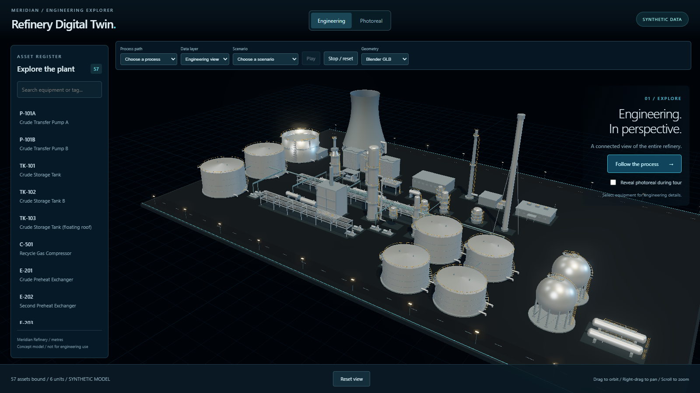

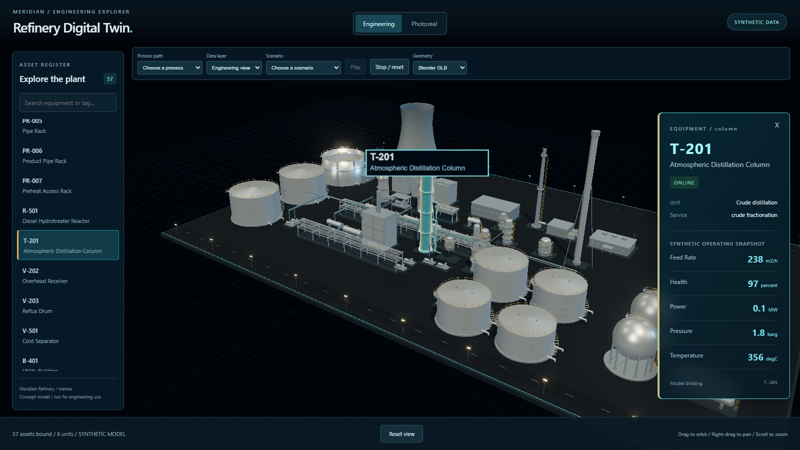

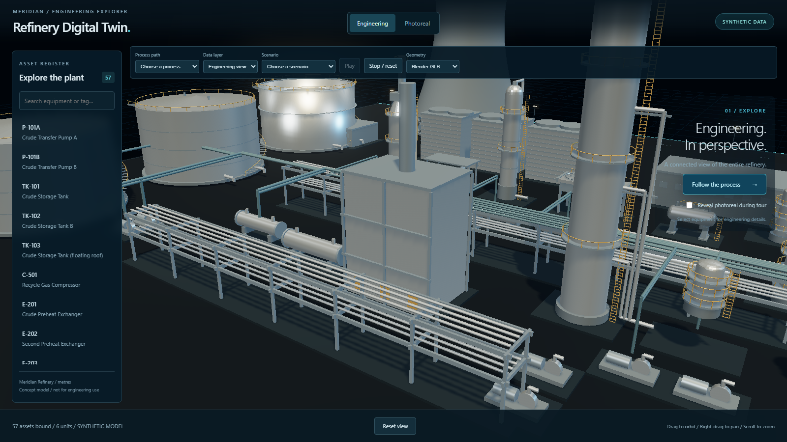

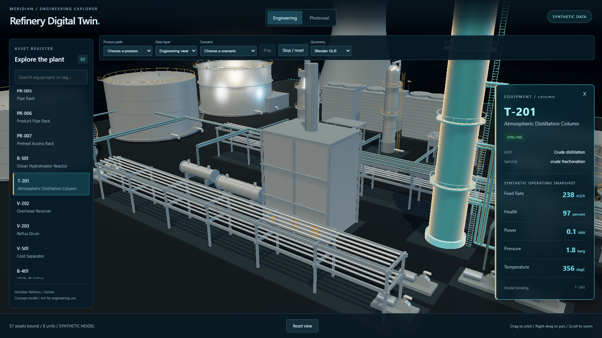

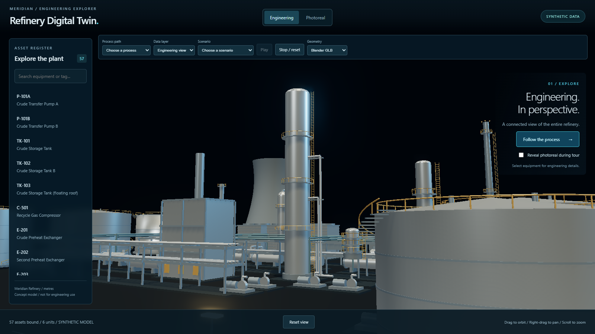

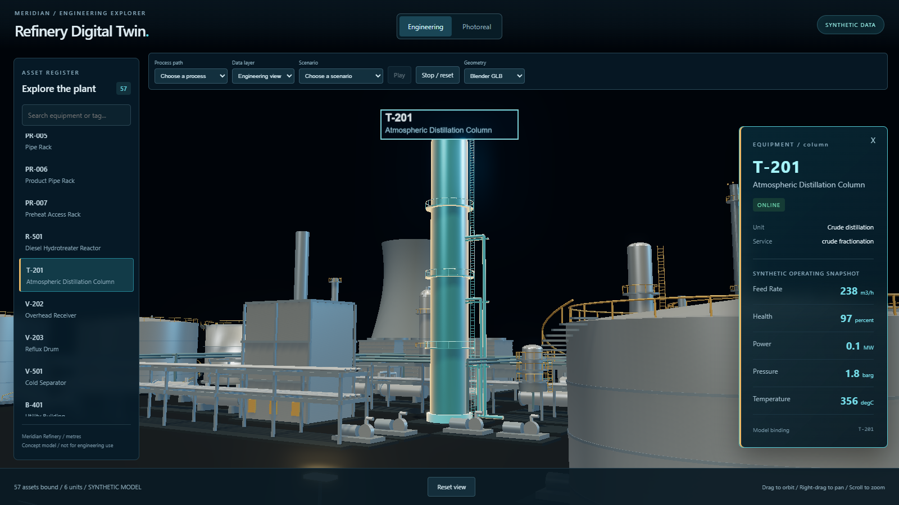

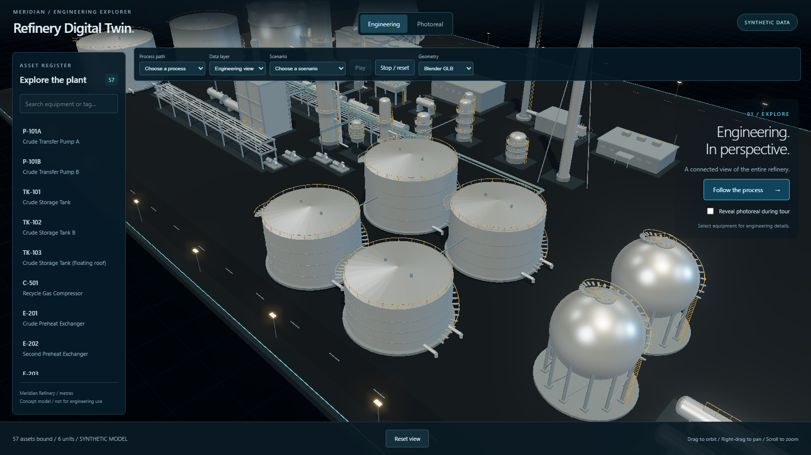

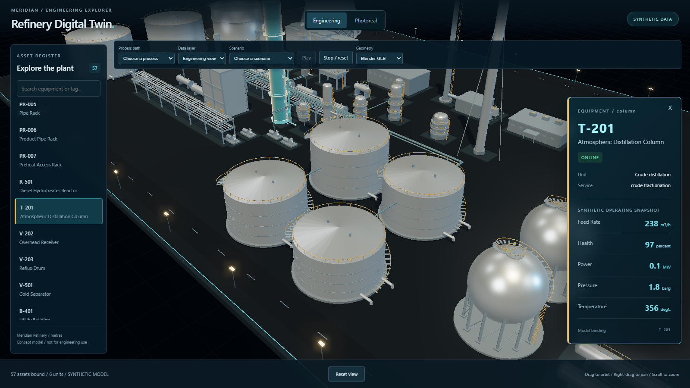

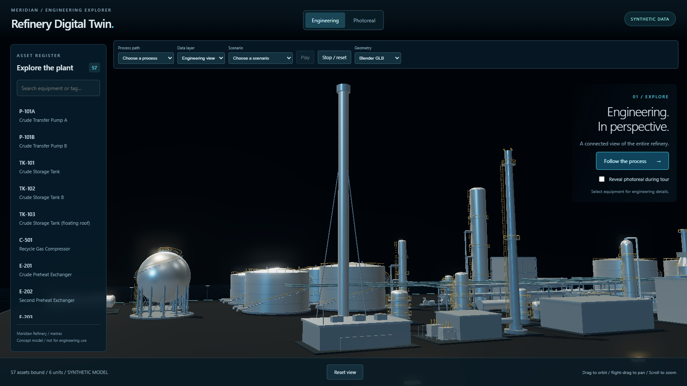

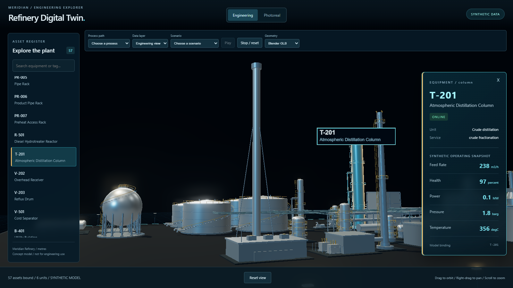

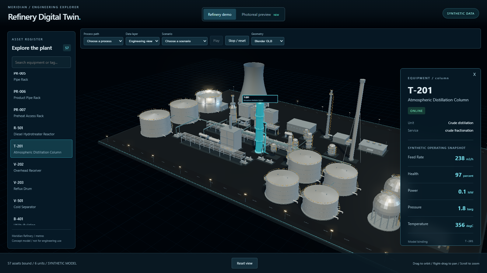

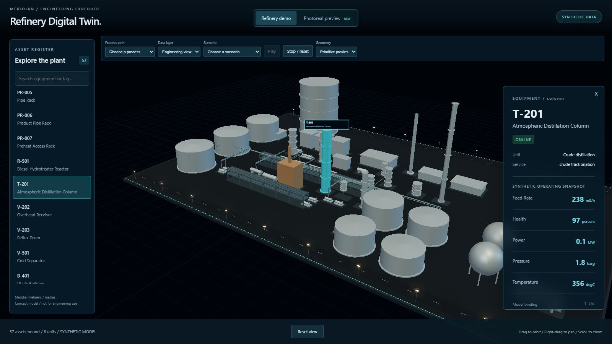

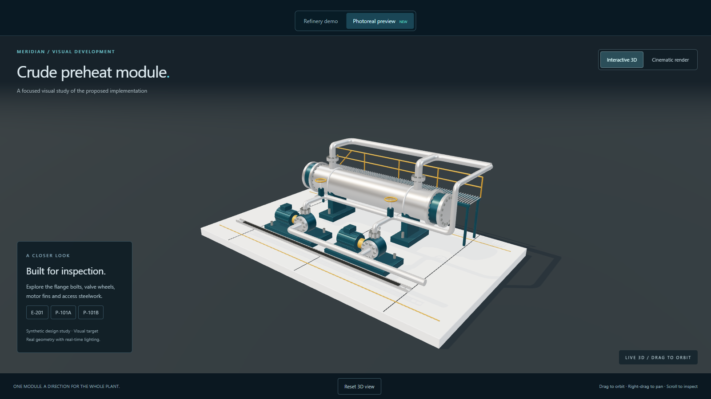

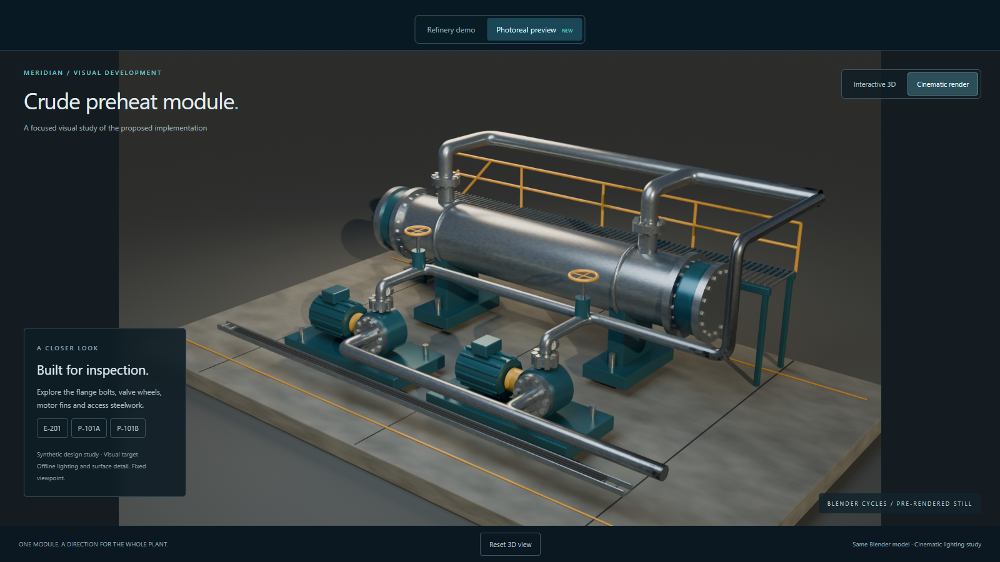

The two study images document the existing separate experience. There is no whole-plant photoreal look yet, so no misleading five-camera photoreal plant baseline is claimed.

## Visual regression result

| Capture | Differing pixels | Result |
|---|---:|---|
| CAM-1-default.png | 0.0000% | PASS |
| CAM-1-selected.png | 0.0000% | PASS |
| CAM-2-default.png | 0.0000% | PASS |
| CAM-2-selected.png | 0.0000% | PASS |
| CAM-3-default.png | 0.0000% | PASS |
| CAM-3-selected.png | 0.0000% | PASS |
| CAM-4-default.png | 0.0000% | PASS |
| CAM-4-selected.png | 0.0000% | PASS |
| CAM-5-default.png | 0.0000% | PASS |
| CAM-5-selected.png | 0.0000% | PASS |


Fresh capture against the candidate baseline, not comparison of a file to itself. Pixelmatch threshold 0.1; antialiasing differences included; maximum 0.5% differing pixels. The browser, GPU, flags and camera configuration are checked against the baseline before comparison.

## Canonical data check

```text
Canonical data unchanged (32 files).
```

The snapshot includes source and normalized record JSON, schemas and the equipment catalog. JSON key order and line endings are normalized; values and array ordering are preserved. Added, changed and deleted truth files fail verification. Fixture tests cover these failures and presentation exclusion without changing plant files. `git diff fb2de98 -- data schemas pipeline/catalog.py` is empty. Normalization was run as part of check and did not change canonical content.

## Blocker

GitHub Pages deployment environment allows only main. Explicit approval is needed to add the exact dual-look branch while retaining main and other protections; then rerun the failed deploy and verify /next/. All remaining Task 0 local work is complete.

## Known issues

- The engineering draw-call total exceeds the proposed Task 2 target. Task 0 and Task 1 are not gated on those proposed limits; no budget is final yet.
- The existing separate study is not a whole-plant photoreal measurement. Consolidation has not started.
- Initial download includes the opt-in measurement code in the built app and uses a local uncompressed server; this is a repeatable transfer baseline, not an internet latency estimate.
- Early GPU detection selected AMD integrated graphics and was correctly rejected. The high-performance flag resolved it. Early development timing used Playwright's mocked clock, which hid Resource Timing; that implementation and its invalid measurements were replaced with Date-only freezing before final evidence.
- Existing Vite large-chunk and Blender user-preference/cache warnings remain; the checks exit successfully.
- The live root must be rebuilt from main because its old Pages artifact expired. The branch workflow guards against dispatches from other branches. A future deployment from main's old workflow can remove `/next/` until this branch is republished; main's workflow is not edited on main.
- The unrelated untracked sibling `real-estate-poc/` is left untouched. The refinery task can be clean while that unrelated directory remains untracked.
- Combined external review of Stage A Task 08 and Stage B Task 0 is pending. Stage B Task 1 is not started.

## Internal reviews and deployment

Spec implementation review: PASS (baseline_spec_review). Code-quality review: PASS (baseline_quality_review). Both agree on implementation quality. The final spec audit also passed local evidence and confirmed that full Task 0 acceptance is blocked solely by deployment.

The [branch run](https://github.com/Mostafanasr1/refinery-digital-twin/actions/runs/35861506203) built and assembled the main-root plus `/next/` artifact successfully. GitHub rejected the deploy job because `github-pages` permits only `main`. The persistent allowlist has not changed. An attempt to authorize adding only `dual-look` was rejected by automatic approval review: preview-publication authorization did not explicitly authorize changing a persistent environment security boundary that can affect the public site. Explicit user approval for that one setting change is pending; no alternate environment or bypass was attempted.

Main remains `6b4ee831512b0356e6904244f0477b37551c5b7f`, and the live root HTML has identical before/after SHA-256 `21B3D8DC4B507606261796C8F6175EAC8326674DBA953D3753C3B5091D8878CF`. `/next/` publication is **not complete**. The task must not be described as fully accepted.

## Commit hash

Implementation and baseline: `37a1fd1b5e4f6cbc85231bd43c87546caf48f1ef`, pushed on `dual-look`. This deployment-blocker write-up is a follow-up documentation commit. Stage B Task 1 has not started.

### deployment.log

```text
X dual-look Deploy to GitHub Pages · 35861506203
Triggered via push about 5 minutes ago

JOBS
✓ build in 39s (ID 107182581369)
X deploy in 1s (ID 107182833607)

ANNOTATIONS
! Node.js 20 is deprecated. The following actions target Node.js 20 but are being forced to run on Node.js 24: actions/checkout@v4, actions/setup-node@v4, actions/upload-artifact@v4. For more information see: https://github.blog/changelog/2025-09-19-deprecation-of-node-20-on-github-actions-runners/
build: .github#2

- "The ubuntu-latest label will migrate to Ubuntu 26 beginning October 19, 2026. For more information, see https://github.com/actions/runner-images/issues/14748"
build: .github#1

X Branch "dual-look" is not allowed to deploy to github-pages due to environment protection rules.
deploy: .github#1

X The deployment was rejected or didn't satisfy other protection rules.
deploy: .github#1


ARTIFACTS
github-pages

To see what failed, try: gh run view 35861506203 --log-failed
View this run on GitHub: https://github.com/Mostafanasr1/refinery-digital-twin/actions/runs/35861506203
```

### remote-refs.log

```text
fb2de982dee3b8eab0eec81de3256fcc4a4d016a	refs/heads/codex/stage-a
37a1fd1b5e4f6cbc85231bd43c87546caf48f1ef	refs/heads/dual-look
6b4ee831512b0356e6904244f0477b37551c5b7f	refs/heads/main
```

### main-preservation.log

```text
Algorithm : SHA256
Hash      : 21B3D8DC4B507606261796C8F6175EAC8326674DBA953D3753C3B5091D8878CF
Path      : C:\Users\Mosta\OneDrive\Documents\ChatGPT\Oil and Gas\refinery-digital-twin-starter\docs\handbacks\evidence\stageB-task-00\live-root-before.html

Algorithm : SHA256
Hash      : 21B3D8DC4B507606261796C8F6175EAC8326674DBA953D3753C3B5091D8878CF
Path      : C:\Users\Mosta\OneDrive\Documents\ChatGPT\Oil and Gas\refinery-digital-twin-starter\docs\handbacks\evidence\stageB-task-00\live-root-after.html
```

### deployment-policy.json

```text
{"total_count":1,"branch_policies":[{"id":59881308,"node_id":"MDE2OkdhdGVCcmFuY2hQb2xpY3k1OTg4MTMwOA==","name":"main","type":"branch"}]}
```

Additional files touched for deployment evidence: `docs/handbacks/evidence/stageB-task-00/deployment.log`, `deployment-policy.json`, `remote-refs.log`, `main-preservation.log`, and `live-root-after.html` (all in that evidence directory).
